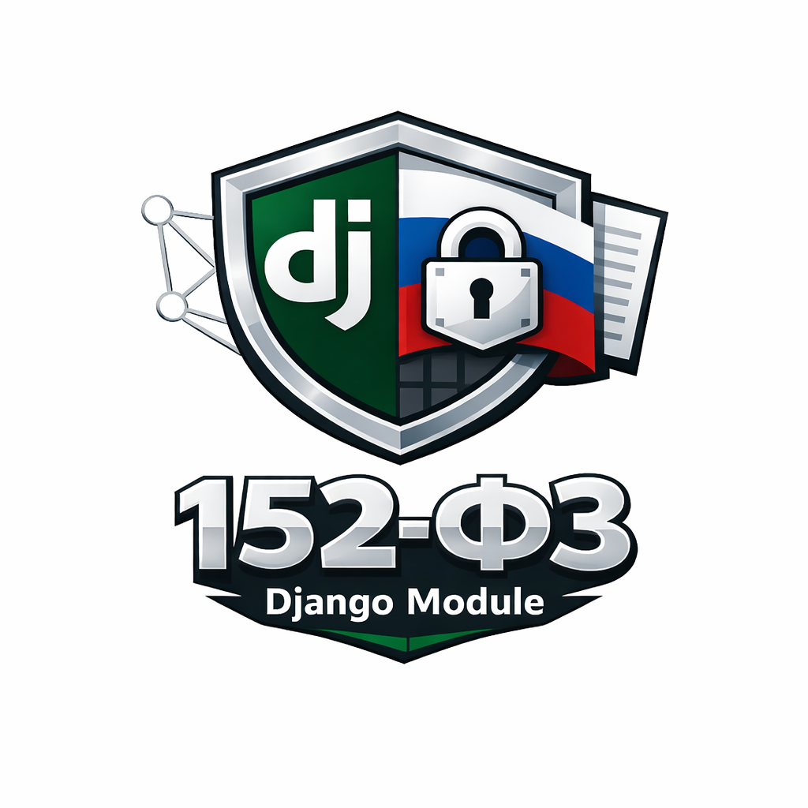

<p align="center">
  
</p>

<h1 align="center">django-consent-152fz repository: consent and cookie modules for 152-FZ workflows</h1>

<p align="center">
  
  
  
  
  
  
</p>

`django-consent-152fz` is a repository with two independent Django packages:

- `django-consent-152fz`: consent lifecycle, document revisions, audit, subject self-service, optional verified-consent flow, service API.
- `django-cookies-152fz`: cookie banner, policy revisions, runtime registry, consent-aware script execution, cookie audit, flexible branding, and mobile-friendly variants.

## Why this project

The module helps teams implement technical controls around personal data and consent handling under Russian legal requirements (152-FZ context).  
For international companies processing personal data of Russian citizens, this can reduce implementation effort by providing reusable consent and cookie workflows.

Related legal context references:

- [DLA Piper Data Protection Laws of the World (Russia)](https://www.dlapiperdataprotection.com/?c=RU)
- [Russia Data Localization Law overview](https://captaincompliance.com/education/russia-data-localization-law)

## Versioning note

`django-consent-152fz` and `django-cookies-152fz` can have different versions and release cadence.  
They are functionally separated modules and do not hard-couple each other's lifecycle, while still being aligned under a common 152-FZ legal implementation context.

## Installation

Consent only:

```bash
pip install django-consent-152fz
```

Cookies only:

```bash
pip install django-cookies-152fz
```

Both modules:

```bash
pip install django-consent-152fz django-cookies-152fz
```

If API endpoints are needed:

```bash
pip install "django-consent-152fz[api]"
```

## Documentation

- [Project documentation (EN)](./docs/README.md)
- [Project documentation (RU)](./docs/README.ru.md)
- [Russian README](./README.ru.md)
- [AI-friendly guides (English only)](./docs/consent/ai/README.md)
- [Changelog](./CHANGELOG.md)
- [Contributing](./CONTRIBUTING.md)
- [Translation contributions](./docs/i18n/README.md)

Russian legal texts and cookie policy templates can be replaced with texts for other jurisdictions. See module docs for authoring and configuration.

## Support

- Community support — GitHub Issues
- Commercial support — contact author
- Legal & technical consulting — on request

## Commercial support

This project is distributed as open-source.

The authors may provide commercial implementation and adaptation services for this package.

Possible engagement areas:

- technical integration into existing systems;
- adaptation to business processes;
- consent and cookie workflow setup;
- implementation architecture and rollout support;
- adaptation for websites, mobile applications, and other platforms;
- integration into existing CMS and frameworks;
- legal and technical advisory on applying Russian personal data requirements (152-FZ);
- adaptation for different jurisdictions;
- custom solution development and support.

Authors allow adaptation of ideas and implementations from this project for other languages, platforms, engines, and technology stacks when required.

The package provides technical tools and does not guarantee automatic legal compliance. Responsibility for determining applicable requirements and organizing personal data processing remains with the operator and their legal advisors.

For implementation and support requests, contact the project authors.

## Legal notice

This project is not affiliated with any government authority.

Users remain responsible for determining applicable legal requirements and obtaining independent legal advice where necessary.
