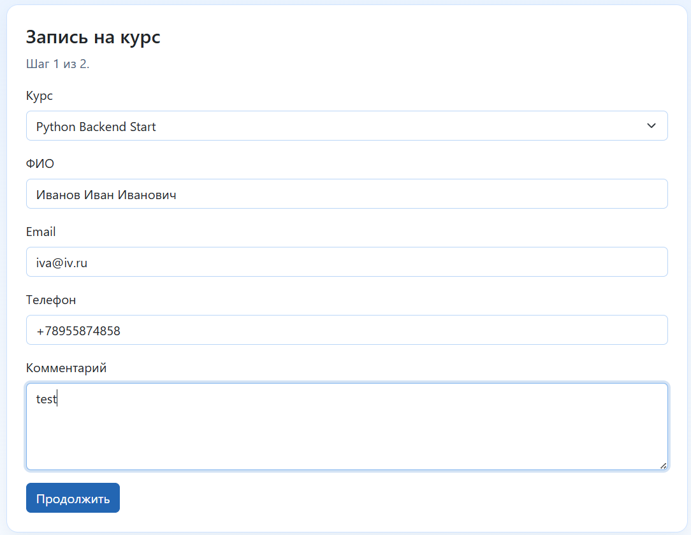

<p align="center">
  
</p>

<h1 align="center">Репозиторий django-consent-152fz: модули согласий и куки для процессов 152-ФЗ</h1>

<p align="center">
  
  
  
  <br>
  
  
  
  
</p>

`django-consent-152fz` — репозиторий с двумя независимыми Django-пакетами:

- `django-consent-152fz`: жизненный цикл согласий, редакции документов, аудит, самообслуживание субъекта, необязательный контур подтвержденных согласий, сервисный прикладной интерфейс.
- `django-cookies-152fz`: баннер куки, редакции политики, реестр исполнения, загрузка сценариев по согласию, аудит куки, гибкая настройка оформления и поддержка мобильных сайтов.

Модули работают независимо друг от друга - каждый можно поставить отдельно. Если нужен только жизненный цикл согласий, можно оставить любой уже используемый баннер куки (или любое другое cookie-решение); если нужен только баннер куки, пакет куки ставится без модуля согласий. Они объединены общей направленностью 152-ФЗ, но не требуют друг друга.

| [Модуль cookie](./docs/cookies/ru/README.md) | [Модуль согласий](./docs/consent/ru/README.md) |
| :---: | :---: |
|  |  |
| Баннер, серверный слой, реестр интеграций и аудит. | Жизненный цикл согласий: документы, записи, аудит и самообслуживание. |

> **Дисклеймер:** этот пакет — технический инструмент, а не юридическая консультация. Его установка сама по себе не делает проект соответствующим 152-ФЗ — юридическую корректность ваших текстов, документов и процессов обработки обеспечивает оператор (самостоятельно или с привлечением юристов). См. [Правовое уведомление](#правовое-уведомление) и [Коммерческая поддержка](./docs/commercial-support.ru.md).

## Для чего проект

Готовые переиспользуемые Django-модули для работы с согласиями и куки по 152-ФЗ: версионируемый жизненный цикл согласий с неизменяемым аудитом, баннер куки с запуском скриптов по согласию, необязательный контур подтвержденных согласий, а также инструменты admin и самообслуживания субъекта.

Вы подключаете цели, документы и тексты - пакет берет на себя процесс, состояние и аудит, поэтому технический контур 152-ФЗ внедряется быстрее, чем при реализации с нуля.

Справочные ссылки:

- [Федеральный закон от 27.07.2006 N 152-ФЗ «О персональных данных» (КонсультантПлюс)](https://www.consultant.ru/document/cons_doc_LAW_61801/)
- [Обзор требований по персональным данным (Tilda Education)](https://tilda.education/articles-personal-data-law)

## Примечание о версиях пакетов

Версии `django-consent-152fz` и `django-cookies-152fz` могут отличаться и выпускаться независимо.  
Это отдельные модули без жесткой взаимной зависимости по жизненному циклу, объединенные общей правовой направленностью 152-ФЗ.

## Установка

Только модуль согласий:

```bash
pip install django-consent-152fz
```

Только модуль куки:

```bash
pip install django-cookies-152fz
```

Оба модуля:

```bash
pip install django-consent-152fz django-cookies-152fz
```

Если нужен прикладной программный интерфейс:

```bash
pip install "django-consent-152fz[api]"
```

## Быстрый старт

Оба модуля включаются добавлением их приложения в `INSTALLED_APPS`, подключением URL и запуском миграций.

**Согласия** — добавьте `"django_consent_152fz"`, настройте `DJANGO_CONSENT_152FZ`, подключите `django_consent_152fz.urls`, затем `migrate`:

```python
INSTALLED_APPS = ["django_consent_152fz", ...]
DJANGO_CONSENT_152FZ = {"enable_core": True}
```

**Куки** — добавьте `"django_cookies_152fz"`, настройте `DJANGO_COOKIES_152FZ`, подключите `django_cookies_152fz.urls` под `cookies/`, выполните `migrate` и отрисуйте баннер в базовом шаблоне:

```python
INSTALLED_APPS = ["django_cookies_152fz", ...]
DJANGO_COOKIES_152FZ = {"enable_cookies": True}
```

```django


```

Полные пошаговые руководства:

- [Быстрый старт модуля согласий](./docs/consent/ru/quickstart.md)
- [Быстрый старт модуля cookie](./docs/cookies/ru/quickstart.md)

## Документация

- [Документация проекта (RU)](./docs/README.ru.md)
- [Project documentation (EN)](./docs/README.md)
- [English README](./README.md)
- [Документы для ИИ (инструкции только на английском)](./docs/consent/ai/README.md)
- [История изменений](./CHANGELOG.ru.md)
- [Участие в проекте](./CONTRIBUTING.ru.md)
- [Политика безопасности](./SECURITY.ru.md)
- [Вклад в переводы](./docs/i18n/README.ru.md)
- [Карта юридических текстов](./docs/legal-texts.ru.md)

Примечание: русские правовые тексты и шаблоны политики куки можно заменить на тексты для любых других юрисдикций. Где лежат эти тексты и как их вычитывать - см. [карту юридических текстов](./docs/legal-texts.ru.md); подробности по наполнению и настройке даны в документации модулей.

## AI-инструкции, поставляемые с пакетами

Помимо репозиторных документов выше, каждый установленный пакет поставляет opt-in инструкции для AI-агентов прямо внутри дистрибутива, в `<package>/ai/` - `AGENTS.md`, `AI_RULES.md`, `AI_CONTEXT.md`, `SKILLS.md`. Чтобы их задействовать, укажите агенту путь, например:

```
@<site-packages>/django_consent_152fz/ai/AGENTS.md
```

Автоматически они не загружаются и не переопределяют правила вашего проекта. Папка `ai/` каждого пакета лежит в пространстве имён своего дистрибутива, поэтому инструкции consent и cookies не конфликтуют между собой. Подробности - в README соответствующего пакета.

## Переводы и интернационализация

Пакеты поставляются с русским (`ru`) и английским (`en`) языками и используют `gettext` из Django, поэтому добавление локали - это просто новая пара `.po`/`.mo`, без изменений в коде.

При этом переносимость у пакетов разная:

- **`django-cookies-152fz` в основном не привязан к юрисдикции.** Он реализует универсальную механику (категории куки, редакции политики, запуск скриптов по согласию, аудит), поэтому адаптация под другую юрисдикцию - это в основном вопрос текстов и локали.
- **`django-consent-152fz` сильнее завязан на 152-ФЗ.** Его ядро (документы, редакции, записи согласий, неизменяемый аудит, самообслуживание) переиспользуемо, но часть логики намеренно ориентирована на РФ - прежде всего контур подтверждённых/бумажных согласий и путь электронной подписи через Госключ, - и у них нет прямого аналога в других странах: это требует доработки, а не просто перевода.

Переводы на другие языки и адаптации под другие юрисдикции (PIPL, GDPR и аналогичные) приветствуются - откройте issue для согласования и пришлите pull request. Процесс описан в разделе [«Вклад в переводы»](./docs/i18n/README.ru.md), а какие тексты зависят от юрисдикции - см. [карту юридических текстов](./docs/legal-texts.ru.md).

**Важно:** перевод локализует интерфейс, а не юридическое соответствие. Применение пакета в другой юрисдикции требует отдельной правовой проверки по её требованиям (см. [Правовое уведомление](#правовое-уведомление)).

## Поддержка и коммерческие услуги

- **Поддержка сообщества** — [GitHub Issues](https://github.com/kroxiksut/django-consent-152fz/issues).
- **Коммерческая поддержка** — авторы оказывают платные услуги по внедрению, адаптации (бизнес-процессы, платформы, другие юрисдикции) и сопровождению для обоих пакетов; техническую часть закрывают авторы, правовую — практикующие юристы. Оказываются отдельно и не входят в состав пакета.

Контакты: [Telegram @FyodorMalkov](https://t.me/FyodorMalkov) · [fmalkov91@gmail.com](mailto:fmalkov91@gmail.com).

Подробности и направления услуг: [Коммерческая поддержка](./docs/commercial-support.ru.md).

## Правовое уведомление

Этот проект не связан с государственными органами.

Пользователь самостоятельно определяет применимые правовые требования и при необходимости получает независимую юридическую консультацию.
