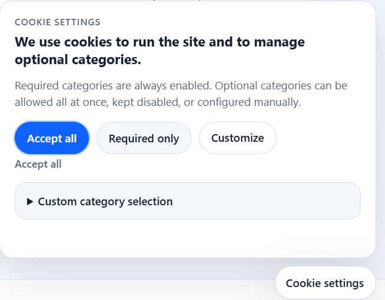
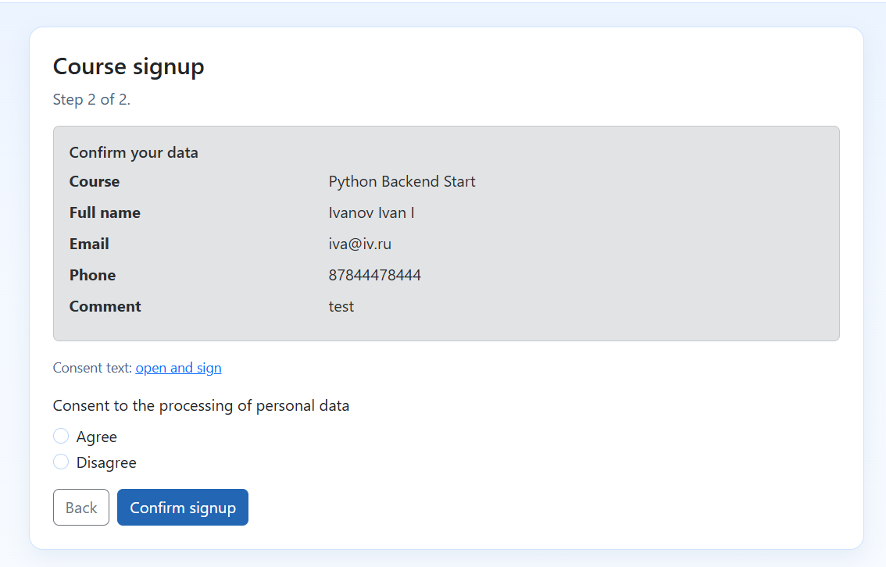

# Project documentation `django-consent-152fz` repository: consent and cookie modules

This is the English top-level documentation index.

## At a glance

| [Cookie module](./cookies/en/README.md) | [Consent module](./consent/en/README.md) |
| :---: | :---: |
|  |  |
| Banner, runtime layer, integration registry and audit. | Consent lifecycle: documents, records, audit and self-service. |

## Main sections

- [Consent module](./consent/en/README.md)
- [Cookie module](./cookies/en/README.md)
- [Legal text inventory and review map](./legal-texts.md)

## Quick start

- [Consent module quick start](./consent/en/quickstart.md)
- [Cookie module quick start](./cookies/en/quickstart.md)

## Package installation map

- `pip install django-consent-152fz` - consent lifecycle module.
- `pip install django-cookies-152fz` - cookie banner and runtime module.
- `pip install django-consent-152fz django-cookies-152fz` - full setup.
- `pip install "django-consent-152fz[api]"` - optional API extras for consent package.

## CI/CD packaging

- [Separate package builds in CI/CD](./ci-cd-packaging.md)

## Versioning note

`django-consent-152fz` and `django-cookies-152fz` may have different package versions and release timing.
They are separated modules and can be used independently.

## AI-friendly guides

AI agent integration guides are maintained as English-only documents:

- [Consent AI guides](./consent/ai/README.md)
- [Cookie AI guides](./cookies/ai/README.md)
- [Cookie languages AI guide](./cookies/ai/languages.md)

## Testing and migration

- [Testing the consent module](./consent/en/testing.md)
- [Consent type checking (Pyright)](./consent/en/type-checking.md)
- [Migration of the consent module](./consent/en/migration.md)
- [Testing the cookie module](./cookies/en/testing.md)
- [Cookie type checking (Pyright)](./cookies/en/type-checking.md)
- [Cookie module migration](./cookies/en/migration.md)

## Localization

- [Translation contributions](./i18n/README.md)

## Consent module map

- [consent/overview.md](./consent/en/overview.md) - overview and current state of the consent layer.
- [consent/invariants.md](./consent/en/invariants.md) - key domain invariants.
- [consent/operations-admin.md](./consent/en/operations-admin.md) - usage, admin sections, and operational scripts.
- [consent/authoring.md](./consent/en/authoring.md) - creating consent flows, working with texts, and document revisions.
- [consent/configuration.md](./consent/en/configuration.md) - settings and policy contract.
- [consent/service-api.md](./consent/en/service-api.md) - public facade and transport contract.
- [consent/testing.md](./consent/en/testing.md) - testing the consent module.
- [consent/type-checking.md](./consent/en/type-checking.md) - why Pyright is required and how to run it.
- [consent/migration.md](./consent/en/migration.md) - migration of the consent module.
- [consent/self-service.md](./consent/en/self-service.md) - subject self-service scripts.
- [consent/access-policies.md](./consent/en/access-policies.md) - access policies and resource scope.
- [consent/verified-flow.md](./consent/en/verified-flow.md) - outline of confirmed consents.
- [consent/goskey.md](./consent/en/goskey.md) - status and conditions for future integration with Goskey.
- [consent/import.md](./consent/en/import.md) - import of historical data.
- [consent/scope-limits.md](./consent/en/scope-limits.md) - boundaries of the scope.
- [consent/demo.md](./consent/en/demo.md) - demo environments for consent scenarios.
- [consent/contributing.md](./consent/en/contributing.md) - module-specific contribution guide.

## Cookie module map

- [cookies/overview.md](./cookies/en/overview.md) - overview of the current state of the cookie module.
- [cookies/invariants.md](./cookies/en/invariants.md) - key invariants of the banner and server layer.
- [cookies/configuration.md](./cookies/en/configuration.md) - lifecycle and server layer configuration.
- [cookies/operations-admin.md](./cookies/en/operations-admin.md) - usage, admin sections, and operations.
- [cookies/contracts.md](./cookies/en/contracts.md) - contract of events and integration points.
- [cookies/presentation.md](./cookies/en/presentation.md) - texts, display options, and visual settings.
- [cookies/inventory.md](./cookies/en/inventory.md) - register and inventory.
- [cookies/testing.md](./cookies/en/testing.md) - testing the cookie module.
- [cookies/type-checking.md](./cookies/en/type-checking.md) - why Pyright is required and how to run it.
- [cookies/migration.md](./cookies/en/migration.md) - cookie module migration.
- [cookies/notes.md](./cookies/en/notes.md) - additional notes.
- [cookies/demo.md](./cookies/en/demo.md) - demo environments for cookie scenarios.
- [cookies/contributing.md](./cookies/en/contributing.md) - module-specific contribution guide.

## Security

- [Security policy and vulnerability reporting](../SECURITY.md)

## Support

- Community support — GitHub Issues
- [Commercial support](./commercial-support.md) — paid implementation, adaptation and rollout for both packages
- Legal & technical consulting — on request

## Contribution guides

- [Contributing (EN)](../CONTRIBUTING.md)
- [Участие в проекте (RU)](../CONTRIBUTING.ru.md)

## Legal notice

This project is not affiliated with any government authority.

Users remain responsible for determining applicable legal requirements and obtaining independent legal advice where necessary.
