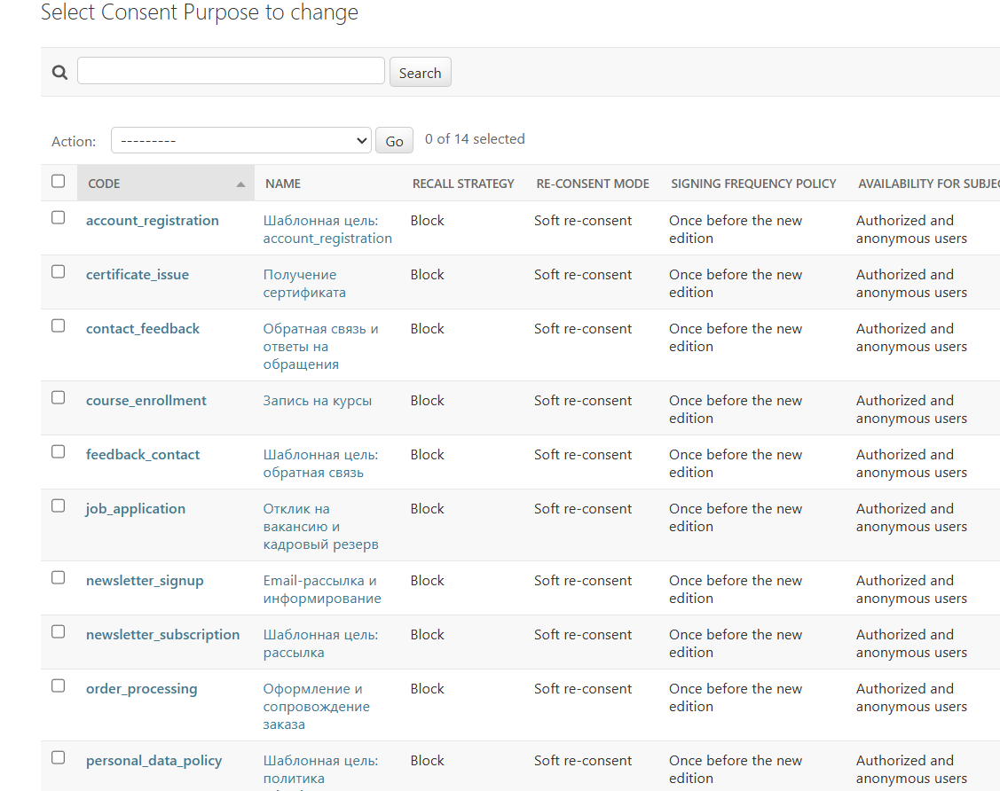
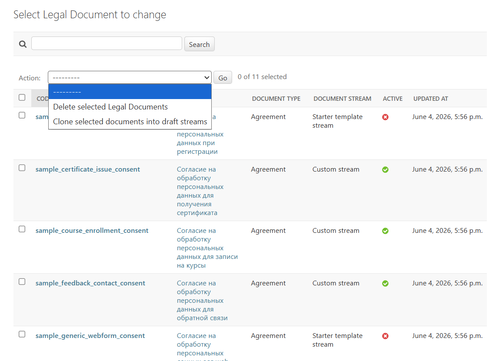
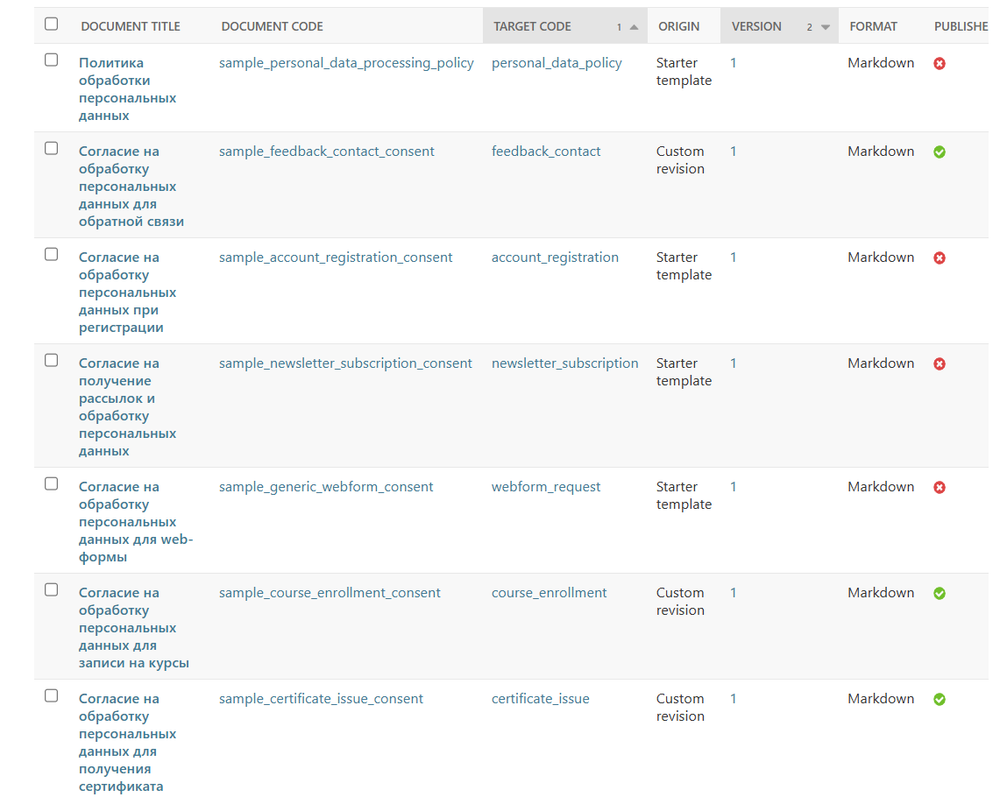

# Consent module: creating and filling consents

- [To the consent section](./README.md)
- [To the general documentation section](../README.md)

## Purpose

This document describes a practical way to create consents:

- how to start a `purpose + document` stream;
- how to choose a text format;
- how to work with starter templates;
- how to edit texts in the admin panel;
- how to connect a visual editor if necessary.

## What does the consent flow consist of?

In the consents module, the workflow is assembled from several entities:

1. `ConsentPurpose` - purpose of processing.
2. `LegalDocument` - the document itself.
3. `DocumentRevision` - specific revision of the document text.
4. `ConsentRecord` - record of an issued consent.
5. `ConsentEvent` - log of changes to that record.

In practice this means:

- first you describe the purpose;
- then create a document;
- then publish a revision of the text;
- only then can the application form rely on this flow.

## Minimum procedure for creating consent

The recommended order is:

1. Create `ConsentPurpose`.
2. Create `LegalDocument`.
3. Create `DocumentRevision`.
4. Publish an active revision.
5. Bind `purpose_code + document_code` to a form or scenario.
6. Check `get_consent_status(...)` before the form business action.
7. Call `accept_consent(...)` only on successful and explicit confirmation.

## How to fill out the purpose of processing

For `ConsentPurpose` it is usually sufficient:

- stable `code`;
- understandable `title`;
- short `description`;
- list of fields in `fields_config`;
- revocation policies;
- re-consent mode;
- subject availability policy.

Practical recommendations:

- `code` should be stable and machine-friendly;
- `title` must be readable by the administrator;
- `description` is best written as a business explanation rather than legal text;
- the list of fields should reflect the real data that is processed in this
flow, not an abstract "reserve for the future."

Processing purposes in the administrative panel:



## How to fill out a document

`LegalDocument` is a container for revisions.

Typically it asks:

- `code`;
- `title`;
- `document_type`;
- description and activity.

Practice:

- do not mix different business scenarios in one document;
- if the scenarios have different texts or different legal grounds, create
separate documents;
- use a stable `document_code` so that application code does not depend on
the document title shown in the interface.

Examples of legal documents in the administrative panel:



## How to fill out the text revision

The legally significant point is precisely `DocumentRevision`.

In the revision you specify:

- link to the document;
- `purpose_code`;
- `version`;
- `format`;
- text or file;
- revision publication.

What is important in practice:

- it is the revision, not `LegalDocument` itself, that is used as the basis for
consent bindings;
- publishing a new revision affects re-consent and obsolescence status;
- old revisions should not be rewritten retroactively.

Document revisions in the administrative panel:



## Which text format to choose

Currently supported:

- `plain_text`;
- `markdown`;
- `html`;
- file revisions, including PDF and office formats.

Recommended choice:

- `markdown` - the main working option for most projects;
- `plain_text` - if you need very simple and predictable text without markup;
- `html` - if you need more complex control over the structure and design;
- file - if the text comes as an approved external document and must be
supplied without reassembly in the text field.

Rule of thumb:

- for new boxed and custom templates it is usually better to start with
  `markdown`;
- `html` should be used where you genuinely need control over the
structure, not just because "it's more common";
- PDF and other file formats are suitable for printed, approved or
externally agreed revisions.

## What to write in the consent text

The module stores and displays text, but does not write a legally correct document
for you.

When filling out the revision, you usually need to explicitly state:

- who the operator is;
- what specific purpose of processing is covered;
- what categories or data fields are processed;
- how the subject confirms consent;
- how the subject can withdraw consent;
- where the linked document is if the consent is part of a larger
package of documents.

Not recommended:

- using the same generic text for all forms without checking its meaning;
- listing data that is not actually collected in this stream;
- copying text from another project without adapting it to your processing model.

## Starter templates and boxed texts

The package already knows how to load starting document templates.

Their purpose:

- give a working starting point;
- reduce the time to first integration;
- show the recommended flow and revision structure.

What's important:

- boxed revisions are treated as samples;
- they need to be tested and adapted;
- for production deployments it is better to make a custom copy and modify
that copy;
- you should not treat the starter text as an automatically ready-made legal
document.

## How to work in the admin area without confusion

A practically safe way is this:

1. Load starter templates if needed.
2. Find a boxed revision.
3. Create a custom copy from it.
4. Edit the custom copy.
5. Publish the custom revision as active.

This is better than changing the boxed revision directly because:

- the original sample is preserved;
- you can see which is the starter template and which is the project's working version;
- it is easier to maintain a history of changes.

## How to edit text in the admin panel

By default, the admin panel of the consent module works according to the principle
`markdown-first`/`textarea-first`:

- the core does not require a mandatory external visual editor;
- the text revision is already suitable for normal workflow;
- plain text, markdown or HTML can be used if necessary.

This is a deliberate decision:

- the basic installation stays simpler;
- the document flow does not carry unnecessary dependencies;
- the integrator decides for themselves whether a visual editor is needed.

## Is it possible to connect WYSIWYG

Yes. The code already provides for connecting an external widget for editing
`DocumentRevision.content_text`.

If you already have an editor installed in your project, you can use
it by passing the widget class path through the settings.

If the project does not yet have an editor, you can install it separately and
connect in the same way.

At the current stage, the module does not impose a specific library and does not provide
native WYSIWYG as a required dependency.

## Settings for the administrative document editor

The settings live in `DJANGO_CONSENT_152FZ["document_templates"]`.

In particular, they support:

- `default_text_format`;
- `admin_editor_mode`;
- `admin_wysiwyg_widget`;
- `admin_wysiwyg_widget_attrs`;
- `html_to_pdf_hook`.

Example:

```python
DJANGO_CONSENT_152FZ = {
    "document_templates": {
        "default_text_format": "markdown",
        "admin_editor_mode": "wysiwyg",
        "admin_wysiwyg_widget": "myproject.widgets.ProjectRichTextWidget",
        "admin_wysiwyg_widget_attrs": {
            "rows": "24",
            "data-editor-profile": "legal",
        },
        "html_to_pdf_hook": "",
    },
}
```

What does it mean:

- `default_text_format` sets the default text format for new revisions;
- `admin_editor_mode` switches the expected operating mode of the admin panel;
- `admin_wysiwyg_widget` specifies the imported Django Forms widget class;
- `admin_wysiwyg_widget_attrs` lets you pass parameters to the widget;
- `html_to_pdf_hook` reserves the path for project-side HTML-to-PDF conversion.

## How to safely use an external editor

Recommended approach:

1. First validate the plain text or markdown flow.
2. Connect a WYSIWYG editor only if the team really needs
visual editing.
3. Use an existing project editor if you have one.
4. Before publishing, check the final revision for the actual HTML output,
list structure, indentation and links.

Important:

- the module supports an external widget, but does not guarantee compatibility with any
third-party library without configuration on the project side;
- legal documents still require meaningful review after
visual editing;
- if the editor generates complex HTML, it is better to check in advance how it
affects display, printing, and PDF export.

## When is it better not to use WYSIWYG?

Stay on `markdown` or `plain_text` if:

- texts are edited by a technical team;
- a predictable diff and a clear history of changes are more important;
- external dependencies need to be minimized;
- the document mainly consists of simple paragraphs, lists and headings.

## How to link a document to an application form

A reliable practical minimum:

- fix `purpose_code`;
- fix `document_code`;
- fix `form_code` if the flow is form-dependent;
- before submitting the form, call `get_consent_status(...)`;
- after successful confirmation, call `accept_consent(...)`;
- for anonymous scenarios, store `anonymous_token`.

A detailed step-by-step example is already given in
[operations-admin.md](./operations-admin.md).

## What belongs to the module and what to the project

The consent module is responsible for:

- storage and versioning;
- publication of revisions;
- linking consent to the revision;
- API and service layer;
- audit trail.

The integrator project is responsible for:

- the actual legal content of the text;
- the choice of editorial process;
- connecting an external WYSIWYG editor, if needed;
- project rules for publishing and approving texts.

## Related documents

- [Use and administration](./operations-admin.md)
- [Settings and policy contract](./configuration.md)
- [Public service API](./service-api.md)
- [Experimental verified consent flow](./verified-flow.md)
