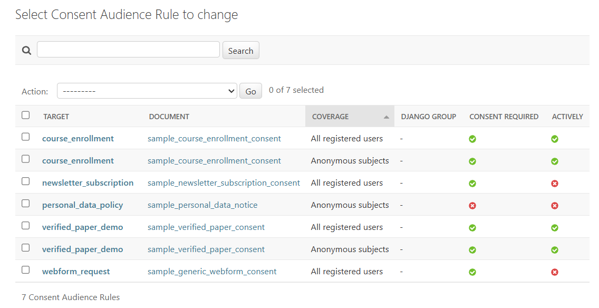
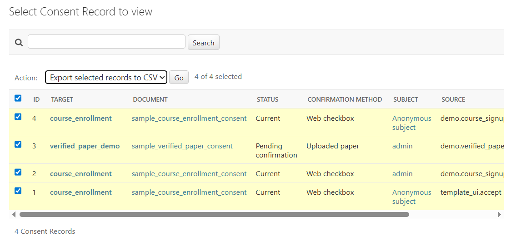
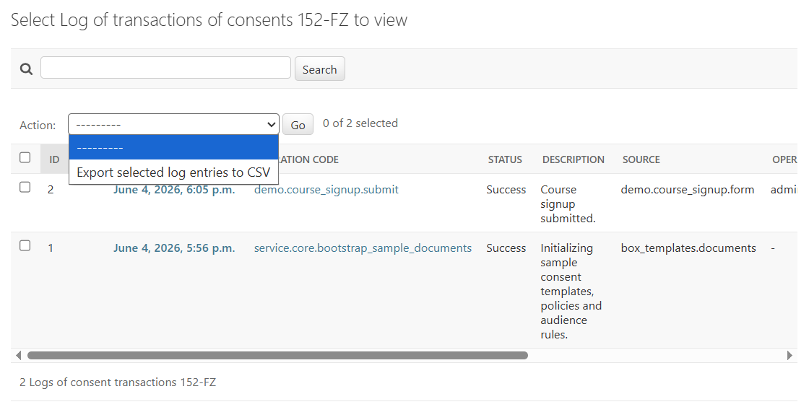
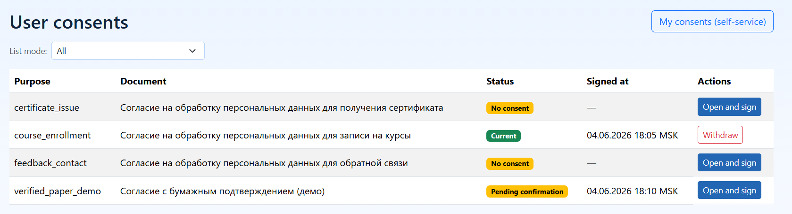
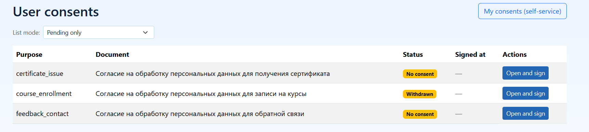
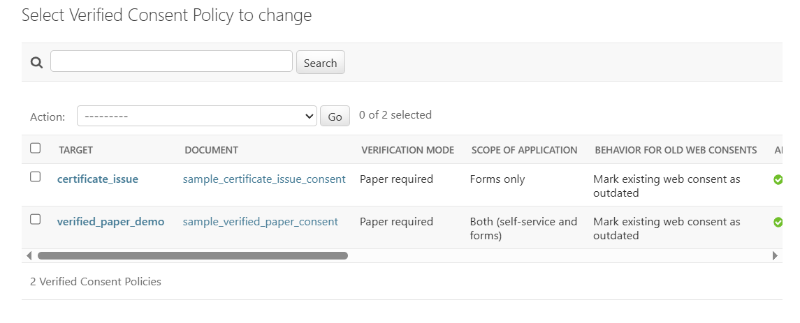
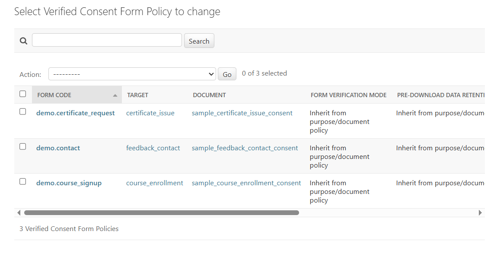
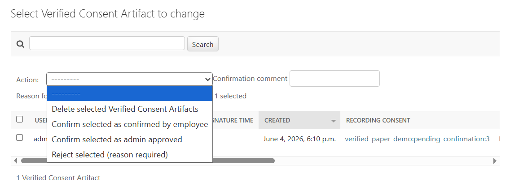
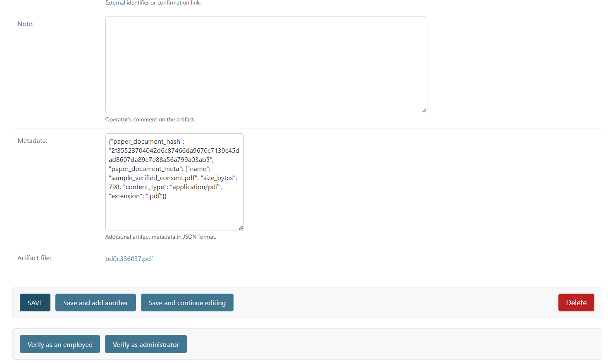

# Consent Module: Use and Administration

- [To the consent section](./README.md)
- [To the general documentation section](../README.md)

## What kind of document is this

This document describes the practical operation of the consent module:
- how to connect the module to a project;
- where and what is configured in the administrative panel;
- how to link a consent document to an application form;
- how to switch the flow from web confirmation to paper confirmation.

## Quick launch path

1. Connect apps and routes.
2. Run migrations.
3. Register processing purposes and documents.
4. Publish active document revisions.
5. Bind the `purpose_code + document_code` stream to the form.
6. Check the consent status on the form and call `accept_consent` when submitting.
7. For a paper scenario, enable `verified_consents`, configure the policy and upload the signed file.

## Connection to the project

### Applications

Minimum set:

```python
INSTALLED_APPS = [
    # ...
    "django_consent_152fz",
]
```

For paper confirmation, add:

```python
INSTALLED_APPS = [
    # ...
    "django_consent_152fz",
    "django_consent_152fz.verified_consents",
]
```

### Routes

```python
from django.urls import include, path

urlpatterns = [
    path(
        "",
        include(
            ("django_consent_152fz.urls", "django_consent_152fz"),
            namespace="django_consent_152fz",
        ),
    ),
]
```

Key routes:
- `/consent/documents/<purpose>/<document>/` - document viewing;
- `/consent/documents/<purpose>/<document>/pdf/` - printed PDF document;
- `/consent/accept/<purpose>/<document>/` - recording consent;
- `/consent/withdraw/<purpose>/<document>/` - withdrawal of consent;
- `/consent/self-service/` - subject self-service.

### Migrations

```bash
python manage.py migrate
```

## Settings `DJANGO_CONSENT_152FZ`

Basic work profile:

```python
DJANGO_CONSENT_152FZ = {
    "enable_core": True,
    "enable_access_policies": False,
    "subject_consents": {
        "open_mode": "page",
        "allow_anonymous_withdraw": True,
        "consent_input_mode": "radio",
        "checkbox_required": True,
        "decline_action": "block_submit",
        "decline_warning_enabled": True,
        "decline_warning_text": (
            "Если вы не согласны на обработку персональных данных, "
            "мы не сможем обработать заявку."
        ),
    },
}
```

Important:
- actual activation of the paper flow is determined by adding
`django_consent_152fz.verified_consents` to `INSTALLED_APPS`;
- the `enable_verified_consents` key is preserved for backward compatibility,
but is not the main switch.

## Full menu map of the administrative panel

The following are the main entities that are used to support consents.

### `ConsentPurpose` (processing purposes)

What can be configured:
- purpose code and name;
- description;
- field set (`fields_config`);
- re-consent policy and subject availability.

When to change:
- when a new form business flow appears.

### `LegalDocument` (documents)

What can be configured:
- document code;
- Name;
- document type;
- activity.

When to change:
- when adding a new document under a target or a new flow.

### `DocumentRevision` (document revisions)

What can be configured:
- link to the document and `purpose_code`;
- format and content of the revision;
- publication (`is_active`) and version.

When to change:
- when updating the consent text.

Important:
- it is the document revision that becomes the legally significant point
to which the consent record is linked.

### `ConsentAudienceRule` (audience rules)

What can be configured:
- whether consent is required for the selected audience;
- coverage (all, group, range).

When to change:
- when only a portion of users/groups need consent.

The audience rules list — coverage and the consent requirement per purpose/document:



### `ConsentAccessPolicy` (access policies)

What can be configured:
- resource and action;
- behavior when consent is missing or outdated;
- link with `purpose + document`.

When to change:
- if consent must limit access to an activity/resource.

### `ConsentRecord` (consent records)

Mode:
- view only.

Purpose:
- checking current/outdated/revoked status;
- audit by user, anonymous token, source.

The records list with the `Export selected records to CSV` action:



A sample of the resulting export:
[consent-records.csv](../../assets/consent/consent-records.csv)

### `ConsentEvent` (consent events)

Mode:
- view only.

Purpose:
- immutable event log (issue, revocation, expiration, confirmation).

### `PersonalDataManagerAssignment`

What can be configured:
- assignment of personnel responsible for personal data;
- rights to manage flows and verified consents.

Notes:
- accessible to superusers only.

### `ConsentSelfServiceSettings`

What can be configured:
- self-service behavior;
- confirmation interface mode;
- PDF print options;
- CSV export separator.

Notes:
- single record;
- accessible to superusers only.

### `ConsentModuleOperationAuditLog`

Mode:
- view only.

Purpose:
- log of consent module operations (admin panel and service actions).

The operation log with the `Export selected log entries to CSV` action:



A sample of the resulting export:
[consent-module-operation-audit.csv](../../assets/consent/consent-module-operation-audit.csv)

## Where to view signed consents

Main operating point: section `ConsentRecord`.

A user's list of consents in the administrative panel:



The same view with the `Pending only` list mode and a withdrawn consent:



How to search for signed ones:
1. Open the `ConsentRecord` list.
2. Set the filter by status:
   - `current` - currently signed;
   - `outdated` - previously signed, but now deprecated.
3. If necessary, filter by purpose (`purpose`) and source (`source`).
4. For a user, search by login/subject ID.
5. For an anonymous stream, search by `anonymous_token`.

What to look for in the record card:
- `purpose` and document code (`document_code`);
- `status`;
- `confirmation_method` (how it was confirmed);
- `source`;
- `created_at`;
- request service metadata in `extra_meta`.

Important:
- `ConsentRecord` in the admin panel works in view mode;
- manual editing and "retroactive correction" are not used;
- to inspect the change history, go to `ConsentEvent`.

## What to do in logs and how to sort out incidents

### `ConsentRecord`: operational status analysis

When to use:
- you need to understand whether there is a current consent for the flow;
- you need to check why the form is asking for confirmation again.

Check procedure:
1. Find the latest record for the subject and the `purpose + document` stream.
2. Check `status` and `consent_required_reason` in the application log/form context.
3. Check `confirmation_method` against the expected scenario (web or verified confirmation).

Available action:
- exporting selected records to CSV.

### `ConsentEvent`: operational history analysis

When to use:
- you need to understand the sequence of actions (issuance, revocation, obsolescence, confirmation);
- you need to check who confirmed or rejected the record, and when.

Check procedure:
1. Open the events of the desired consent record.
2. Sort by time (`occurred_at`).
3. Check `event_type`, `actor_type`, `actor_user`, `source`, `payload`.

Practice:
- `ConsentRecord` shows the current status;
- `ConsentEvent` shows how that state was reached.

### `ConsentModuleOperationAuditLog`: log of administrative and service operations

When to use:
- to check mass transactions;
- to analyze errors in service commands and actions in the administrative panel.

Check procedure:
1. Filter by `operation_code` or `status`.
2. Check `payload` (input parameters) and `result` (outcome).
3. For batch operations, compare the number of processed records against the expectation.

Available action:
- exporting selected records to CSV.

## Typical tasks in the administrative panel

### You need to check whether a user has signed consent on a specific form

1. Open `ConsentRecord`.
2. Find the user.
3. Filter by `purpose` and `document`.
4. Make sure the status is `current`.
5. Check `confirmation_method`.

### You need to understand why the signature does not appear on the form

1. In `ConsentRecord`, check whether there is a current record for the stream.
2. In `ConsentEvent`, check the latest events and the reason for rejection/blocking.
3. If using a paper flow, check `VerifiedConsentSubmission` and `VerifiedConsentArtifact`.
4. In `ConsentModuleOperationAuditLog`, check for service operation errors.

### You need to verify the bulk transition of a flow to paper confirmation

1. Open `ConsentModuleOperationAuditLog`.
2. Find the transition operations by `operation_code` from the verified flow.
3. Check `changed_records` and the number of processed batches.
4. Additionally, check the selection of subjects in `ConsentRecord` for the desired stream.

## Additional paper flow menus

These entities are available when the application is connected
`django_consent_152fz.verified_consents`.

### `VerifiedConsentPolicy`

What can be configured:
- `verification_mode` (`web_only`, `paper_required`, `goskey_required`, `paper_or_goskey`);
- `flow_scope` (`both`, `self_service_only`, `forms_only`);
- behavior for previously issued web consents (`legacy_web_consent_policy`);
- subject notification and download modes.

What to do:
- enable/disable the requirement for paper confirmation for the flow;
- set soft or strict behavior for old web consents.

The flow-level policies — verification mode, scope and behavior for old web consents:



### `VerifiedConsentFormPolicy`

What can be configured:
- overriding the mode for a specific form by `form_code`;
- behavior before the paper file is uploaded;
- overriding the notification channel.

What to do:
- enable paper confirmation only for a specific form;
- gradually expand coverage without affecting other forms in the flow.

The per-form overrides keyed by `form_code`:



### `VerifiedConsentSubmission`

Mode:
- status board for paper confirmation requests.

Purpose:
- see what step the flow is at (`awaiting_paper_upload`,
  `paper_uploaded`, `verified`, `rejected`).

What to do:
- monitor the queue of requests awaiting upload or verification;
- check that a request has reached the `verified` status after processing.

### `VerifiedConsentArtifact`

Purpose:
- storage of the uploaded confirmation file and operator actions;
- confirmation or rejection of the artifact by the person responsible for the personal data.

What to do:
- open the confirmation file;
- confirm or reject it with a comment;
- record the reason for rejection so the subject can resubmit.

Operator actions on a paper consent in the admin panel:



A single artifact card — document hash, uploaded file and the `Verify as employee` / `Verify as administrator` actions:



## How to link a document to a form

Below is a practical scenario used on the demo site.

### Step 1: Capture the stream codes

For the form, define a stable link in advance:
- `purpose_code`;
- `document_code`;
- `form_code`.

Example from the demo:
- `demo.contact`;
- `demo.course_signup`;
- `demo.certificate_request`.

### Step 2. Prepare the goal, document and active revision

In the administrative panel:
1. Create or update `ConsentPurpose`.
2. Create `LegalDocument`.
3. Create `DocumentRevision` for the desired `purpose_code`.
4. Publish the revision (`is_active=True`).

### Step 3. Connect the consent fields in the form

For Django form use `ConsentCaptureModeMixin`:

```python
from django import forms
from django_consent_152fz.forms import ConsentCaptureModeMixin


class ContactForm(ConsentCaptureModeMixin, forms.ModelForm):
    class Meta:
        model = ContactMessage
        fields = ("full_name", "email", "message")
```

### Step 4. Pass `verification_context` to the handler

```python
verification_context = {
    "channel": "form",
    "form_code": "demo.contact",
}
```

### Step 5: Check the stream status before sending

```python
status_info = get_consent_status(
    purpose_code=purpose_code,
    document_code=document_code,
    user=user,
    anonymous_token=anonymous_token,
    verification_context=verification_context,
)
consent_required = bool(status_info.get("requires_consent"))
```

### Step 6. If you successfully submit the form, record your consent

```python
accept_consent(
    purpose_code=purpose_code,
    document_code=document_code,
    user=user,
    anonymous_token=anonymous_token,
    confirmation_method=ConsentRecord.ConfirmationMethod.WEB_CHECKBOX,
    verification_context=verification_context,
    audit_context=build_request_audit_context(
        request,
        source="demo.contact.form",
        anonymous_token=anonymous_token,
    ),
)
```

### Step 7. In the template, provide a link to the document

There should be a clear point for the user to view the consent text:
- a link to `django_consent_152fz:document`;
- for the paper scenario, also a link to `django_consent_152fz:document_pdf`.

### Step 8: Store the anonymous token after responding

For anonymous scenarios, after a successful response, store the token via
`persist_anonymous_token(response, anonymous_token=...)`.

## Switching from web confirmation to paper confirmation

Below is a recommended step-by-step scenario.

### 1. Connect the paper flow

Add to `INSTALLED_APPS`:
- `django_consent_152fz.verified_consents`.

Run migrations.

### 2. Create a basic flow policy

In `VerifiedConsentPolicy` set:
- desired stream `purpose + document`;
- `verification_mode=paper_required` (or other mode);
- `flow_scope` for scope;
- `legacy_web_consent_policy` for legacy web consent behavior.

### 3. If necessary, set an override for the form

In `VerifiedConsentFormPolicy`:
- specify `form_code`;
- set `verification_mode_override` if the form should work differently,
than the basic flow policy.

### 4. In the form, account for `verified_transition`

If `verified_transition.enabled=True` and the status is not `verified`:
- block web signing;
- display a message about the required paper confirmation;
- provide a link to download the confirmation document.

In the demo this is implemented for the certificate application form:
- web signing is hidden;
- a link to download the PDF and an upload page for the signed file are displayed.

### 5. Set up a paper upload point

In the upload handler, call `submit_verified_consent(...)` and pass:
- `purpose_code`, `document_code`;
- `paper_file`;
- `verification_context` with the same `form_code`;
- `audit_context`.

After upload, the record enters a pending state until it is checked by the operator.

### 6. Perform a soft migration of historical web consents

Before applying, always do a preliminary run:

```bash
python manage.py transition_152fz_verified_legacy_web \
  --purpose-code certificate_issue \
  --document-code sample_certificate_issue_consent \
  --channel form \
  --form-code demo.certificate_request \
  --dry-run
```

Then apply in batches:

```bash
python manage.py transition_152fz_verified_legacy_web \
  --purpose-code certificate_issue \
  --document-code sample_certificate_issue_consent \
  --channel form \
  --form-code demo.certificate_request \
  --batch-size 500 \
  --apply
```

### 7. Operator processing

The person responsible for personal data checks artifacts in `VerifiedConsentArtifact`:
- confirms;
- rejects with reason.

Statuses are tracked in `VerifiedConsentSubmission`.

## Practice from the demo site

Solutions that have shown consistent results:
- each application form has a constant `form_code`;
- the view code uses the `purpose_code/document_code` constants;
- `get_consent_status(...)` is always called before submitting the form;
- paper scenario blocking is handled before the form business action;
- paper upload is placed on a separate `verified_paper_consent` screen;
- after login and in anonymous mode, stream continuity is preserved via
  `anonymous_token`.

Practical smoke-check checklist: `demo/notes/smoke-checklist.md`.

## Related documents

- [Settings](./configuration.md)
- [Public service API](./service-api.md)
- [Paper confirmation flow](./verified-flow.md)
- [Testing](./testing.md)
- [Migration](./migration.md)
