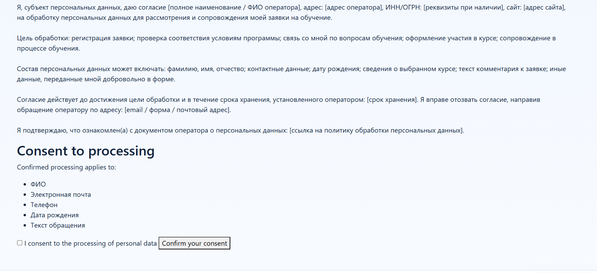
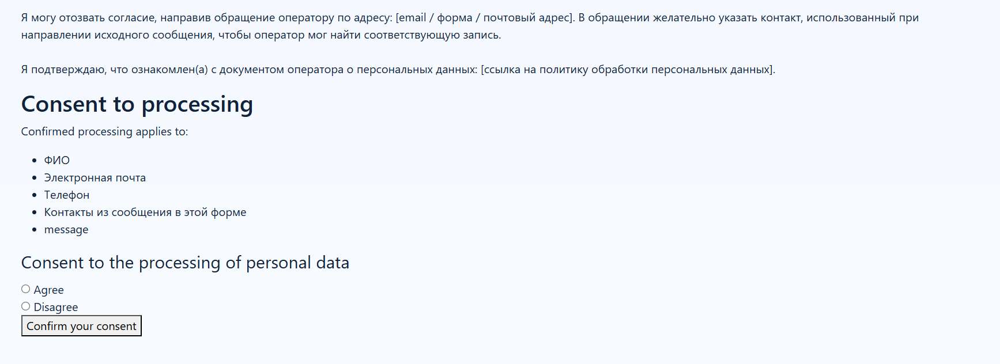
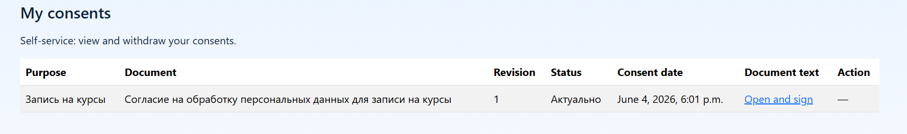

# Consent Module: Subject Self-Service Scenarios

- [To the consent section](./README.md)
- [To the general documentation section](../README.md)

## Alpha scope

Self-service in its current scope covers:
- viewing current subject consents;
- withdrawing consent for a specific `purpose + document` stream.

## What it looks like

A typical subject journey — from the signup form to managing their own consents.

Consent on the course signup form:

Consent confirmation:

The rendered consent document the subject reviews before confirming:

The subject's personal list of consents (self-service):

## What is not included in the scope

- A full-fledged personal account with arbitrary legal workflow scenarios.
- A complete "right to be forgotten" process with external workflow and SLA.

## Behavior Settings

`DJANGO_CONSENT_152FZ["subject_consents"]`:
- `open_mode`: `page` | `new_window` | `modal`;
- `consent_input_mode`: `checkbox` | `radio`;
- `checkbox_required`: confirmation required;
- `decline_action`: `block_submit` | `allow_submit`;
- `allow_anonymous_withdraw`: anonymous withdrawal policy.

## Route

- `django_consent_152fz:subject_consents` (`/consent/self-service/`).

## Localization

- The self-service interface uses the standard Django localization contract (`.po/.mo`).
- Changes to custom strings are accompanied by translation updates.
