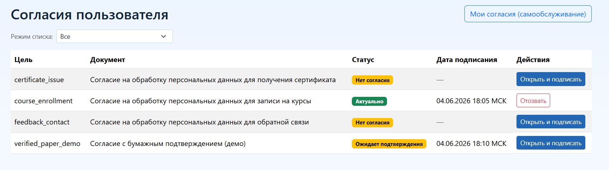
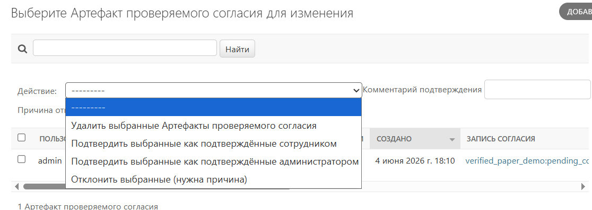

# Модуль согласий: использование и администрирование

- [К разделу согласий](./README.md)
- [К общему разделу документации](../README.md)

## Что это за документ

Документ описывает практическую эксплуатацию модуля согласий:
- как подключить модуль в проект;
- где и что настраивается в административной панели;
- как привязать документ согласия к прикладной форме;
- как перевести поток с веб-подтверждения на бумажное подтверждение.

## Быстрый путь запуска

1. Подключите приложения и маршруты.
2. Выполните миграции.
3. Зарегистрируйте цели обработки и документы.
4. Опубликуйте активные редакции документов.
5. Привяжите поток `purpose_code + document_code` к форме.
6. Проверьте статус согласия в форме и вызов `accept_consent` при отправке.
7. Для бумажного сценария подключите `verified_consents`, настройте политику и загрузку подписанного файла.

## Подключение в проект

### Приложения

Минимальный набор:

```python
INSTALLED_APPS = [
    # ...
    "django_consent_152fz",
]
```

Для бумажного подтверждения добавьте:

```python
INSTALLED_APPS = [
    # ...
    "django_consent_152fz",
    "django_consent_152fz.verified_consents",
]
```

### Маршруты

```python
from django.urls import include, path

urlpatterns = [
    path(
        "",
        include(
            ("django_consent_152fz.urls", "django_consent_152fz"),
            namespace="django_consent_152fz",
        ),
    ),
]
```

Ключевые маршруты:
- `/consent/documents/<purpose>/<document>/` - просмотр документа;
- `/consent/documents/<purpose>/<document>/pdf/` - печатный PDF документа;
- `/consent/accept/<purpose>/<document>/` - фиксация согласия;
- `/consent/withdraw/<purpose>/<document>/` - отзыв согласия;
- `/consent/self-service/` - самообслуживание субъекта.

### Миграции

```bash
python manage.py migrate
```

## Настройки `DJANGO_CONSENT_152FZ`

Базовый рабочий профиль:

```python
DJANGO_CONSENT_152FZ = {
    "enable_core": True,
    "enable_access_policies": False,
    "subject_consents": {
        "open_mode": "page",
        "allow_anonymous_withdraw": True,
        "consent_input_mode": "radio",
        "checkbox_required": True,
        "decline_action": "block_submit",
        "decline_warning_enabled": True,
        "decline_warning_text": (
            "Если вы не согласны на обработку персональных данных, "
            "мы не сможем обработать заявку."
        ),
    },
}
```

Важно:
- фактическое включение бумажного контура определяется подключением
  `django_consent_152fz.verified_consents` в `INSTALLED_APPS`;
- ключ `enable_verified_consents` сохранён для обратной совместимости,
  но не является главным переключателем.

## Полная карта меню административной панели

Ниже перечислены основные сущности, которые используются для сопровождения согласий.

### `ConsentPurpose` (цели обработки)

Что настраивается:
- код и название цели;
- описание;
- набор полей (`fields_config`);
- политика повторного согласия и доступность субъекта.

Когда менять:
- при появлении нового бизнес-потока формы.

### `LegalDocument` (документы)

Что настраивается:
- код документа;
- название;
- тип документа;
- активность.

Когда менять:
- при добавлении нового документа под цель или новый поток.

### `DocumentRevision` (редакции документов)

Что настраивается:
- связка с документом и `purpose_code`;
- формат и содержание редакции;
- публикация (`is_active`) и версия.

Когда менять:
- при обновлении текста согласия.

Важно:
- именно редакция документа становится юридически значимой точкой,
  к которой привязывается запись согласия.

### `ConsentAudienceRule` (правила аудитории)

Что настраивается:
- требуется ли согласие для выбранной аудитории;
- охват (все, группа, диапазон действия).

Когда менять:
- когда согласие нужно только части пользователей/групп.

### `ConsentAccessPolicy` (политики доступа)

Что настраивается:
- ресурс и действие;
- реакция при отсутствии или устаревшем согласии;
- связка с `purpose + document`.

Когда менять:
- если согласие должно ограничивать доступ к действию/ресурсу.

### `ConsentRecord` (записи согласий)

Режим:
- только просмотр.

Назначение:
- проверка текущего/устаревшего/отозванного статуса;
- аудит по пользователю, анонимному токену, источнику.

### `ConsentEvent` (события согласий)

Режим:
- только просмотр.

Назначение:
- неизменяемый журнал событий (выдача, отзыв, устаревание, подтверждение).

### `PersonalDataManagerAssignment`

Что настраивается:
- назначение ответственных за ПДн;
- права на управление потоками и проверяемыми согласиями.

Особенности:
- доступ только суперпользователю.

### `ConsentSelfServiceSettings`

Что настраивается:
- поведение самообслуживания;
- режим интерфейса подтверждения;
- параметры печатного PDF;
- разделитель CSV-экспорта.

Особенности:
- единичная запись;
- доступ только суперпользователю.

### `ConsentModuleOperationAuditLog`

Режим:
- только просмотр.

Назначение:
- журнал операций модуля согласий (действия админки и сервисов).

## Где смотреть подписанные согласия

Основная рабочая точка: раздел `ConsentRecord`.

Список согласий пользователя в административной панели:



Как искать подписанные:
1. Откройте список `ConsentRecord`.
2. Поставьте фильтр по `Статус`:
   - `current` - актуально подписано;
   - `outdated` - подписано ранее, но устарело.
3. При необходимости отфильтруйте по цели (`purpose`) и источнику (`source`).
4. Для пользователя используйте поиск по логину/идентификатору субъекта.
5. Для анонимного потока используйте поиск по `anonymous_token`.

Что смотреть в карточке записи:
- `purpose` и код документа (`document_code`);
- `status`;
- `confirmation_method` (как подтверждено);
- `source`;
- `created_at`;
- служебные метаданные запроса в `extra_meta`.

Важно:
- `ConsentRecord` в админке работает в режиме просмотра;
- ручное редактирование и «исправление задним числом» не используется;
- для разбора истории изменений переходите в `ConsentEvent`.

## Что делать в журналах и как разбирать инциденты

### `ConsentRecord`: операционный разбор состояния

Когда использовать:
- нужно понять, есть ли актуальное согласие по потоку;
- нужно проверить, почему форма повторно запрашивает подтверждение.

Порядок проверки:
1. Найти последнюю запись по субъекту и потоку `purpose + document`.
2. Проверить `status` и `consent_required_reason` в прикладном логе/контексте формы.
3. Сверить `confirmation_method` с ожидаемым сценарием (веб или проверяемое подтверждение).

Доступное действие:
- выгрузка выбранных записей в CSV.

### `ConsentEvent`: операционный разбор истории

Когда использовать:
- нужно понять последовательность действий (выдача, отзыв, устаревание, подтверждение);
- нужно проверить, кто и когда подтвердил или отклонил запись.

Порядок проверки:
1. Откройте события нужной записи согласия.
2. Отсортируйте по времени (`occurred_at`).
3. Проверьте `event_type`, `actor_type`, `actor_user`, `source`, `payload`.

Практика:
- `ConsentRecord` показывает текущее состояние;
- `ConsentEvent` показывает, как к этому состоянию пришли.

### `ConsentModuleOperationAuditLog`: журнал административных и сервисных операций

Когда использовать:
- для проверки массовых операций;
- для разбора ошибок служебных команд и действий в административной панели.

Порядок проверки:
1. Фильтровать по `operation_code` или `status`.
2. Проверять `payload` (входные параметры) и `result` (итог).
3. Для пакетных операций сравнивать объём обработанных записей с ожиданием.

Доступное действие:
- выгрузка выбранных записей в CSV.

## Типовые задачи в административной панели

### Нужно проверить, подписал ли пользователь согласие по конкретной форме

1. Откройте `ConsentRecord`.
2. Найдите пользователя.
3. Отфильтруйте по `purpose` и `document`.
4. Убедитесь, что статус `current`.
5. Проверьте `confirmation_method`.

### Нужно понять, почему подпись не проходит в форме

1. В `ConsentRecord` проверьте, есть ли актуальная запись по потоку.
2. В `ConsentEvent` проверьте последние события и причину отклонения/блокировки.
3. Если используется бумажный контур, проверьте `VerifiedConsentSubmission` и `VerifiedConsentArtifact`.
4. В `ConsentModuleOperationAuditLog` проверьте ошибки сервисных операций.

### Нужно проверить массовый переход потока на бумажное подтверждение

1. Откройте `ConsentModuleOperationAuditLog`.
2. Найдите операции перехода по `operation_code` из verified-контура.
3. Сверьте `changed_records` и число обработанных пакетов.
4. Дополнительно проверьте выборку субъектов в `ConsentRecord` по нужному потоку.

## Дополнительные меню бумажного контура

Эти сущности доступны при подключённом приложении
`django_consent_152fz.verified_consents`.

### `VerifiedConsentPolicy`

Что настраивается:
- `verification_mode` (`web_only`, `paper_required`, `goskey_required`, `paper_or_goskey`);
- `flow_scope` (`both`, `self_service_only`, `forms_only`);
- поведение для ранее выданных веб-согласий (`legacy_web_consent_policy`);
- режимы уведомлений и загрузки субъектом.

Что делать:
- включать/выключать требование бумажного подтверждения для потока;
- задавать мягкое или жёсткое поведение для старых веб-согласий.

### `VerifiedConsentFormPolicy`

Что настраивается:
- переопределение режима для конкретной формы по `form_code`;
- поведение до загрузки бумаги;
- переопределение канала уведомлений.

Что делать:
- точечно включать бумажное подтверждение только для конкретной формы;
- постепенно расширять охват, не затрагивая остальные формы потока.

### `VerifiedConsentSubmission`

Режим:
- доска статусов по заявкам бумажного подтверждения.

Назначение:
- видеть, на каком шаге находится поток (`awaiting_paper_upload`,
  `paper_uploaded`, `verified`, `rejected`).

Что делать:
- контролировать очередь заявок, ожидающих загрузки или проверки;
- проверять, что заявка дошла до статуса `verified` после обработки.

### `VerifiedConsentArtifact`

Назначение:
- хранение загруженного подтверждающего файла и операторских действий;
- подтверждение или отклонение артефакта ответственным за ПДн.

Что делать:
- открывать файл подтверждения;
- подтверждать или отклонять с комментарием;
- фиксировать причину отклонения для повторной отправки субъектом.

Операторские действия с бумажным согласием в админке:



## Как привязать документ к форме

Ниже практический сценарий, который используется в демо-сайте.

### Шаг 1. Зафиксируйте коды потока

Для формы заранее задайте стабильную связку:
- `purpose_code`;
- `document_code`;
- `form_code`.

Пример из демо:
- `demo.contact`;
- `demo.course_signup`;
- `demo.certificate_request`.

### Шаг 2. Подготовьте цель, документ и активную редакцию

В административной панели:
1. Создайте или актуализируйте `ConsentPurpose`.
2. Создайте `LegalDocument`.
3. Создайте `DocumentRevision` для нужного `purpose_code`.
4. Опубликуйте редакцию (`is_active=True`).

### Шаг 3. Подключите поля согласия в форме

Для Django-формы используйте `ConsentCaptureModeMixin`:

```python
from django import forms
from django_consent_152fz.forms import ConsentCaptureModeMixin


class ContactForm(ConsentCaptureModeMixin, forms.ModelForm):
    class Meta:
        model = ContactMessage
        fields = ("full_name", "email", "message")
```

### Шаг 4. Передайте в обработчик `verification_context`

```python
verification_context = {
    "channel": "form",
    "form_code": "demo.contact",
}
```

### Шаг 5. Перед отправкой проверяйте статус потока

```python
status_info = get_consent_status(
    purpose_code=purpose_code,
    document_code=document_code,
    user=user,
    anonymous_token=anonymous_token,
    verification_context=verification_context,
)
consent_required = bool(status_info.get("requires_consent"))
```

### Шаг 6. При успешной отправке формы фиксируйте согласие

```python
accept_consent(
    purpose_code=purpose_code,
    document_code=document_code,
    user=user,
    anonymous_token=anonymous_token,
    confirmation_method=ConsentRecord.ConfirmationMethod.WEB_CHECKBOX,
    verification_context=verification_context,
    audit_context=build_request_audit_context(
        request,
        source="demo.contact.form",
        anonymous_token=anonymous_token,
    ),
)
```

### Шаг 7. В шаблоне давайте ссылку на документ

Для пользователя должна быть явная точка просмотра текста согласия:
- ссылка на `django_consent_152fz:document`;
- для бумажного сценария - также ссылка на `django_consent_152fz:document_pdf`.

### Шаг 8. Сохраняйте анонимный токен после ответа

Для анонимных сценариев после успешного ответа сохраняйте токен через
`persist_anonymous_token(response, anonymous_token=...)`.

## Переход с веб-подтверждения на бумажное

Ниже рекомендуемый пошаговый сценарий.

### 1. Подключите бумажный контур

Добавьте в `INSTALLED_APPS`:
- `django_consent_152fz.verified_consents`.

Выполните миграции.

### 2. Создайте базовую политику потока

В `VerifiedConsentPolicy` задайте:
- нужный поток `purpose + document`;
- `verification_mode=paper_required` (или другой режим);
- `flow_scope` для области применения;
- `legacy_web_consent_policy` для поведения старых веб-согласий.

### 3. При необходимости задайте переопределение для формы

В `VerifiedConsentFormPolicy`:
- укажите `form_code`;
- задайте `verification_mode_override`, если форма должна работать иначе,
  чем базовая политика потока.

### 4. В форме учитывайте `verified_transition`

Если `verified_transition.enabled=True` и статус не `verified`:
- блокируйте веб-подписание;
- показывайте сообщение о требуемом бумажном подтверждении;
- давайте ссылку на загрузку подтверждения.

В демо это реализовано для формы заявки на сертификат:
- веб-подписание скрывается;
- выводится ссылка на скачивание PDF и страницу загрузки подписанного файла.

### 5. Организуйте точку загрузки бумаги

В обработчике загрузки вызывайте `submit_verified_consent(...)` и передавайте:
- `purpose_code`, `document_code`;
- `paper_file`;
- `verification_context` с тем же `form_code`;
- `audit_context`.

После загрузки запись перейдёт в ожидающее состояние до проверки оператором.

### 6. Выполните мягкий перевод исторических веб-согласий

Перед применением всегда делайте предварительный прогон:

```bash
python manage.py transition_152fz_verified_legacy_web \
  --purpose-code certificate_issue \
  --document-code sample_certificate_issue_consent \
  --channel form \
  --form-code demo.certificate_request \
  --dry-run
```

Потом пакетное применение:

```bash
python manage.py transition_152fz_verified_legacy_web \
  --purpose-code certificate_issue \
  --document-code sample_certificate_issue_consent \
  --channel form \
  --form-code demo.certificate_request \
  --batch-size 500 \
  --apply
```

### 7. Операторская обработка

Ответственный за ПДн проверяет артефакты в `VerifiedConsentArtifact`:
- подтверждает;
- отклоняет с причиной.

Статусы отслеживаются в `VerifiedConsentSubmission`.

## Практика из демо-сайта

Решения, которые показали стабильный результат:
- у каждой прикладной формы есть постоянный `form_code`;
- в коде представления используются константы `purpose_code/document_code`;
- перед отправкой формы всегда вызывается `get_consent_status(...)`;
- блокировка по бумажному сценарию обрабатывается до бизнес-действия формы;
- загрузка бумаги вынесена в отдельный экран `verified_paper_consent`;
- после входа и в анонимном режиме сохраняется непрерывность потока по
  `anonymous_token`.

Практический чеклист смоук-проверки: `demo/notes/smoke-checklist.md`.

## Связанные документы

- [Настройки](./configuration.md)
- [Публичный сервисный API](./service-api.md)
- [Контур бумажного подтверждения](./verified-flow.md)
- [Тестирование](./testing.md)
- [Миграция](./migration.md)
