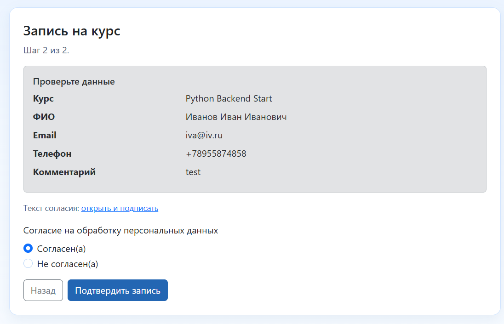
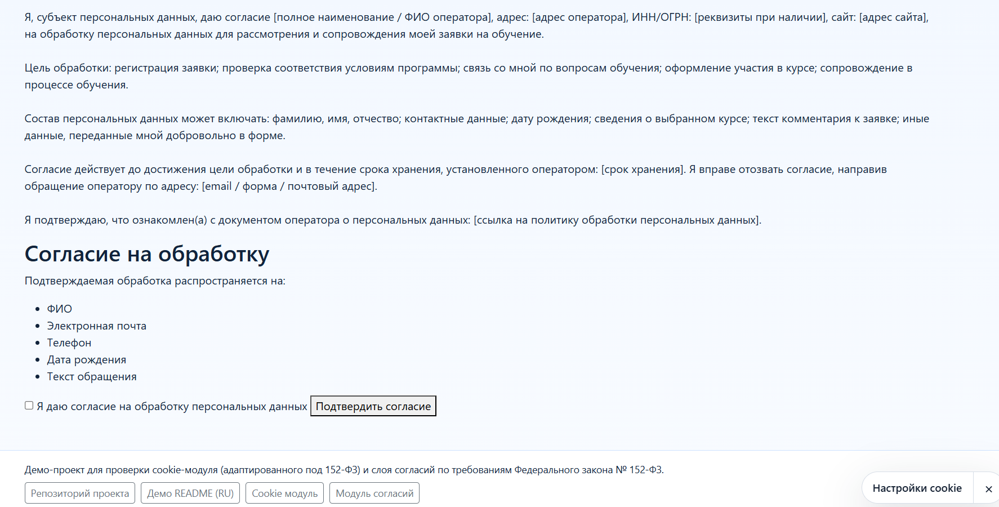
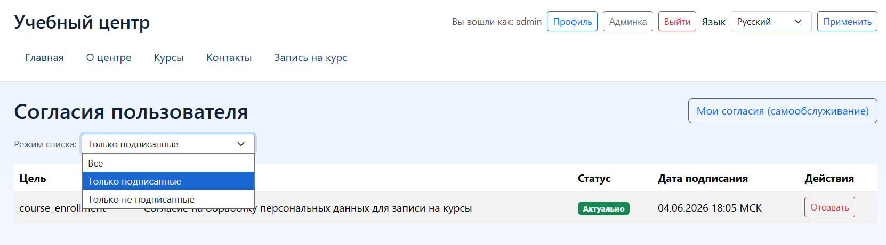

# Модуль согласий: сценарии самообслуживания субъекта

- [К разделу согласий](./README.md)
- [К общему разделу документации](../README.md)

## Альфа-область

Самообслуживание в текущей области покрывает:
- просмотр текущих согласий субъекта;
- отзыв согласия по конкретному потоку `purpose + document`.

## Как это выглядит

Типовой путь субъекта — от формы записи до управления своими согласиями.

Согласие на форме записи на курс:

Подтверждение согласия:

Пример текста соглашения:

Личный список согласий субъекта (самообслуживание):

## Что не входит в область

- Полноценный личный кабинет с произвольными юридическими сценариями работы.
- Полный процесс «права на забвение» с внешним документооборотом и SLA.

## Настройки поведения

`DJANGO_CONSENT_152FZ["subject_consents"]`:
- `open_mode`: `page` | `new_window` | `modal`;
- `consent_input_mode`: `checkbox` | `radio`;
- `checkbox_required`: обязательность подтверждения;
- `decline_action`: `block_submit` | `allow_submit`;
- `allow_anonymous_withdraw`: политика анонимного отзыва.

## Маршрут

- `django_consent_152fz:subject_consents` (`/consent/self-service/`).

## Локализация

- Интерфейс самообслуживания использует стандартный контракт локализации Django (`.po/.mo`).
- Изменения пользовательских строк сопровождаются обновлением переводов.

## Навигация по разделу

- Предыдущий: [Миграция модуля согласий](./migration.md)
- Следующий: [Политики доступа и область ресурсов](./access-policies.md)
