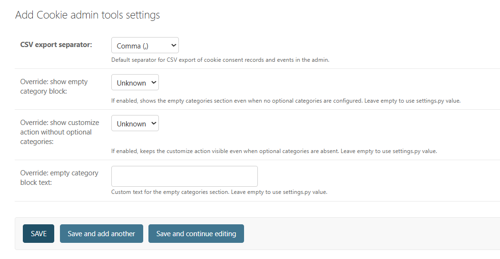
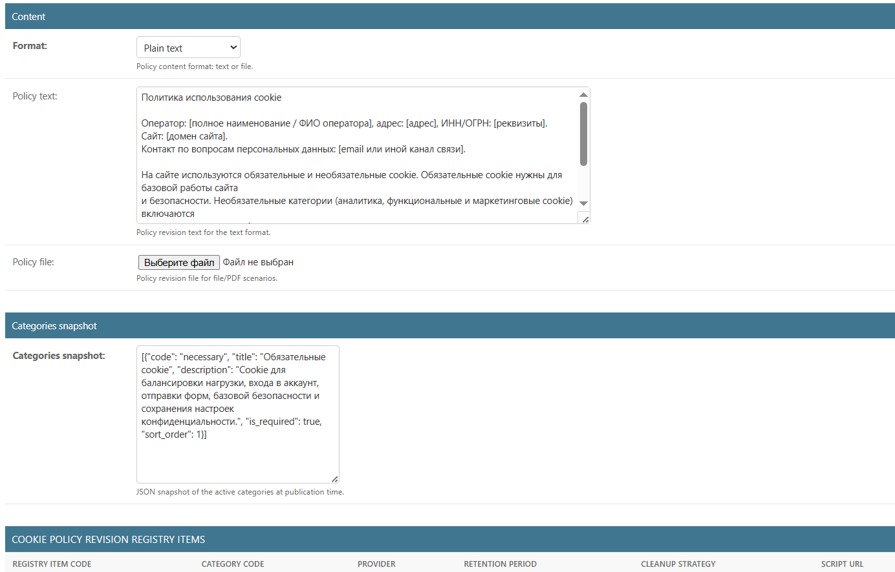
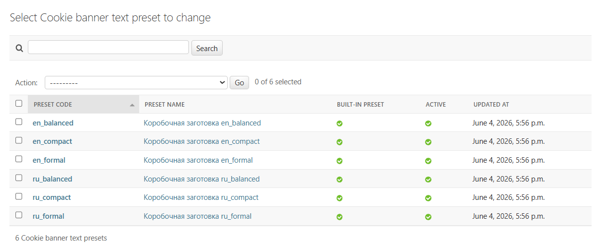
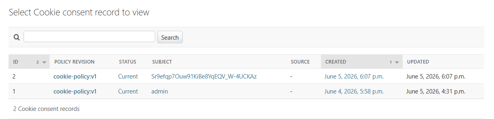

# Cookie module: use and administration

- [Go to cookies section](./README.md)
- [To the general documentation section](../README.md)

## What kind of document is this

This document describes the working scenario for using the cookie module:
- how to include the module in a project;
- where categories, policies and banners are configured in the administrative panel;
- which sections in the administrative panel are for viewing only;
- which commands to use for initial initialization and maintenance.

## Quick launch path

1. Connect apps and routes.
2. Perform migrations.
3. Run initial boxed data initialization.
4. Check the cookie categories and integrations registry.
5. Prepare and publish a cookie policy revision.
6. Prepare and publish a cookie banner revision.
7. Connect the banner to the website template.
8. Check the settings page `/cookies/` and banner actions `/cookies/banner/`.

## Connection to the project

### Applications

Make sure `INSTALLED_APPS` has:
- `django_cookies_152fz`;
- `django_consent_152fz` (if a common flow of consents and settings checks is used).

### Routes

Connect the cookie module routes:

```python
from django.urls import include, path

urlpatterns = [
    path("", include("django_cookies_152fz.urls")),
]
```

Available routes:
- `/cookies/` — category selection management page;
- `/cookies/banner/` — banner action handler.

### Template

Include the banner tag in the base template:

```django

...

```

## Settings in `settings.py`

The basic configuration of the cookie module is set in `DJANGO_COOKIES_152FZ`.

```python
DJANGO_COOKIES_152FZ = {
    "enable_cookies": True,
    "default_cookie_category_codes": ["necessary"],
    "cookie_banner": {
        "bootstrap_initial_revision": True,
        "preferences_page_template": "django_cookies_152fz/cookie_preferences.html",
        "banner_variant": "card",
        "consent_ui_variant": "panel",
        "reconsent_notice_variant": "inline",
        "text_preset": "ru_balanced",
    },
    "cookie_runtime": {
        "force_banner": False,
        "preview_param": "cookie_banner_preview",
        "custom_css_url": "",
        "custom_js_url": "",
        "hide_for_bots": True,
        "bot_patterns": [],
        "user_agent_mode": "all",
        "shared_subdomain": False,
        "site_domain": "",
        "cookie_domain": "",
        "geo_signal_hook": "",
    },
    "cookie_retention": {
        "batch_size": 500,
        "records_older_than_days": None,
        "events_older_than_days": None,
        "banner_states_older_than_days": None,
        "records_max_count": None,
        "events_max_count": None,
        "banner_states_max_count": None,
        "private_records_older_than_days": None,
        "private_events_older_than_days": None,
        "private_signal_paths": [],
        "protect_current_records": True,
    },
}
```

Where to configure what:
- display behavior and banner options: `cookie_banner`;
- technical behavior in request and domain: `cookie_runtime`;
- cleaning and audit volumes: `cookie_retention`.

## Primary initialization

After migrations run:

```bash
python manage.py bootstrap_152fz_cookie_defaults
```

The command creates:
- boxed cookie categories;
- a starting cookie policy revision;
- a starting cookie banner revision.

## Full menu map of the administrative panel

All registered cookie admin entities are listed below.

### `Cookie admin tool settings`

What is this:
- a single entry for technical settings of the administrative panel.

What can be configured:
- `csv_export_delimiter` — CSV export separator.

Peculiarities:
- superuser access only;
- the entry cannot be deleted;
- only one entry can be added.



### `Cookie categories`

What is this:
- directory of categories for grouping cookies and building a snapshot in the policy revision.

What can be configured:
- code, title, description;
- mandatory category;
- sort order;
- activity.

When to change:
- when a new processing category appears or classification changes.

### `Cookie Registry Elements`

What is this:
- a registry of technical integrations (cookies and scripts) that depend on the user’s decision.

What can be configured:
- integration code;
- category;
- vendor;
- purpose;
- retention period;
- cleanup strategy;
- source (`src_url`);
- activity.

When to change:
- when connecting/disconnecting external systems and analytics.

### `Cookie-policy text presets`

What is this:
- cookie policy text templates.

What can be configured:
- preset code and title;
- policy text;
- boxed/custom version markers;
- activity.

Actions:
- cloning selected presets into custom presets.

### `Cookie policy revisions`

What is this:
- versioned revisions of the cookie policy text that are published and become active.

What can be configured:
- format and text of the revision;
- snapshot of categories;
- the active-revision marker.

Actions:
- publishing the selected boxed version of the text;
- creating a custom draft from a boxed version;
- cloning selected revisions into drafts.

Important:
- when published, a new active revision disables the previous one;
- the registry is synchronized into a revision snapshot;
- previously valid consents are converted to outdated.



### `Cookie banner text presets`

What is this:
- cookie banner text templates.

What can be configured:
- headings, captions, button texts, texts for the no-JavaScript mode;
- boxed/custom version markers;
- activity.

Actions:
- cloning selected presets into custom presets.



### `Cookie banner revisions`

What is this:
- versioned revisions of the cookie banner (texts, display options and visual parameters).

Where the settings are:
- block `Texts`: all custom banner labels;
- block `Display options`: banner option, selection interface type, notification option;
- block `Visual customization`: color and visual parameters;
- block `Visibility and close button`: show, close, blocking behavior and mobile overrides;
- block `Deprecated compatibility fields`: backward-compatibility fields.

Actions:
- cloning selected banner revisions into custom drafts.

Important:
- for boxed revisions, protected text fields are read-only;
- when published, a new active revision disables the previous one.

### `Cookie-policy revision registry elements`

What is this:
- a snapshot of the integration registry at the time of a specific policy revision.

Mode:
- viewing only, no editing.

Purpose:
- auditing compliance with the published policy and the composition of integrations.

### `Cookie Consent Records`

What is this:
- the final state of category selection for the subject.

Mode:
- viewing only.

Purpose:
- monitoring of current/outdated status;
- search by user, anonymous token, request ID.



### `Cookie Consent Events`

What is this:
- a log of consent events (acceptance, update, deprecation and related actions).

Mode:
- viewing only.

Actions:
- export selected events to CSV.

### `Cookie banner states`

What is this:
- the server state of the banner lifecycle by subject.

Mode:
- viewing only.

Purpose:
- diagnostics of re-display, close, selected action and blocking mode.

## Where to configure by task

### You need to change the cookie policy text

1. Open `Cookie-policy text presets` and prepare the variant.
2. In `Cookie policy revisions`, create a revision (or a draft from a preset).
3. Publish the revision as active.

### You need to change the appearance/behavior of the banner

1. Open `Cookie banner text presets` and correct the texts.
2. Open `Cookie banner revisions`.
3. Set up the blocks `Display options`, `Visual customization`, `Visibility and close button`.
4. Publish the revision.

### Need to add a new integration (script/cookie)

1. Add or update the category in `Cookie categories` (if required).
2. Add an entry to `Cookie Registry Elements`.
3. Check that the active `Cookie policy revisions` reflects the current snapshot.

### Need to export events to CSV

1. Open `Cookie Consent Events`.
2. Select the records.
3. Apply the `Export selected events to CSV` action.
4. If necessary, specify the delimiter in `Cookie admin tool settings` in advance.

### Need to clear old audit records

Run:

```bash
python manage.py cleanup_152fz_cookie_audit --dry-run
python manage.py cleanup_152fz_cookie_audit
```

Cleaning parameters are set in `DJANGO_COOKIES_152FZ["cookie_retention"]`.

## Practice from demo site

Below are solutions that showed stable behavior on the demo site and are suitable as a working implementation template.

### Embedding a banner

- the banner is connected once in the base website template via ``;
- this covers all public pages without duplicating template markup;
- a separate link in the top menu to the cookie settings page is not required if the banner reopen button is enabled.

### Routes

- the main set of project routes is connected separately from the cookie routes;
- a separate prefix `/cookies/` is used for the cookie module;
- this simplifies diagnostics and reduces the risk of route name collisions.

### Working profile settings

For a public site, the demo consistently used the following scheme:
- `cookie_banner.show_launcher=True`;
- `cookie_banner.show_preferences_link=False`;
- `cookie_runtime.hide_for_bots=True`;
- `cookie_runtime.preview_param="cookie_banner_preview"`;
- an explicit list of bot patterns in `cookie_runtime.bot_patterns`.

The meaning of the scheme:
- the user can always reopen the banner with a button;
- extra entry points to the settings page do not overload the interface;
- for search bots, the banner does not interfere with crawling pages;
- banner preview mode is available manually via the URL parameter.

### Data Initialization

- after migrations, `bootstrap_152fz_cookie_defaults` is launched;
- for a demonstration stand, automation of this step via `post_migrate` is acceptable;
- For a production environment, it is better to use an explicit command run in the deployment script to avoid implicit data changes.

### Checks after changes

After each change in cookie settings in the demo, the following were necessarily rechecked:
- displaying the banner and page `/cookies/` in Russian and English;
- saving category selection;
- re-selection;
- no errors in the browser console and in the server log;
- absence of regressions in the base site (public pages, forms, login, administrative panel).

A separate checklist from the demo: `demo/notes/smoke-checklist.md`.

## Integration Inventory

To check that the registry is consistent with the categories:

```bash
python manage.py inventory_152fz_cookie_integrations
```

This is a supporting report. The classification decision is made by the operator.

#### CSV delimiter behavior for event export

- `Cookie consent events` export uses `csv_export_delimiter` from `Cookie admin settings`.
- Allowed delimiters: `,`, `;`, `TAB` (`\t`), `|`.
- Invalid values safely fall back to `,`.

