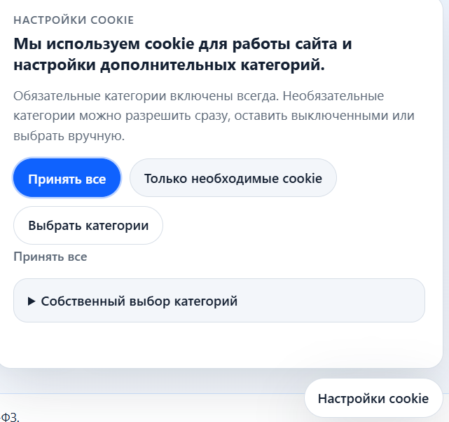

# Документация: модуль куки

Раздел описывает `django-cookies-152fz`: баннер куки, серверный слой обработки выбора, реестр интеграций и аудит.

## Навигация

- [К общему разделу документации](../README.md)

## Основные документы

- [Быстрый старт](./quickstart.md)
- [Обзор и текущее состояние](./overview.md)
- [Сравнение с django-cookie-consent](./comparison-django-cookie-consent.md)
- [Ключевые инварианты](./invariants.md)
- [Настройки жизненного цикла и серверного слоя](./configuration.md)
- [Использование, меню админки и настройка](./operations-admin.md)
- [Контракт событий DOM и серверных перехватов](./contracts.md)
- [Версионируемые тексты и оформление](./presentation.md)
- [Рекомендательная инвентаризация и ограничения](./inventory.md)
- [Тестирование модуля куки](./testing.md)
- [Проверка типов (Pyright)](./type-checking.md)
- [Миграция модуля куки](./migration.md)
- [Раздельная сборка пакетов в CI/CD](../../ci-cd-packaging.ru.md)
- [Дополнительные заметки](./notes.md)
- [Демо-стенды](./demo.md)
- [Участие в разработке модуля куки](./contributing.md)

## Инструкции для ИИ по задачам модуля куки

- Изменения текстов баннера и слоя представления: см. [AI-гайды интеграции](../ai/README.md).
- Поведение исполнения, загрузка скриптов и контракт событий: см. [runtime.md](../ai/runtime.md).
- Инструкция по добавлению новых языков: [../ai/languages.md](../ai/languages.md).

## Поддержка

- Поддержка сообщества — GitHub Issues
- [Коммерческая поддержка](../../commercial-support.ru.md) — связь с авторами
- Юридическое и техническое консультирование — по запросу

## Правовое уведомление

Этот проект не связан с государственными органами.

Пользователь самостоятельно определяет применимые правовые требования и при необходимости получает независимую юридическую консультацию.
