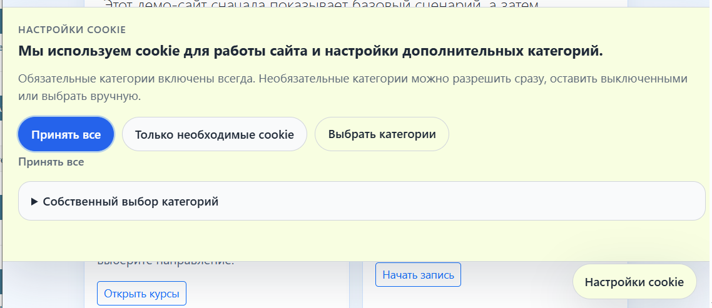
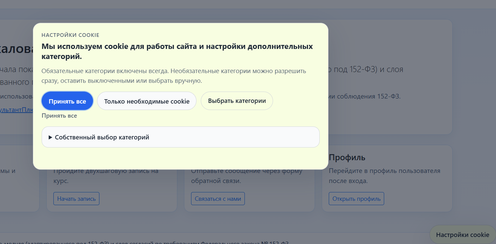
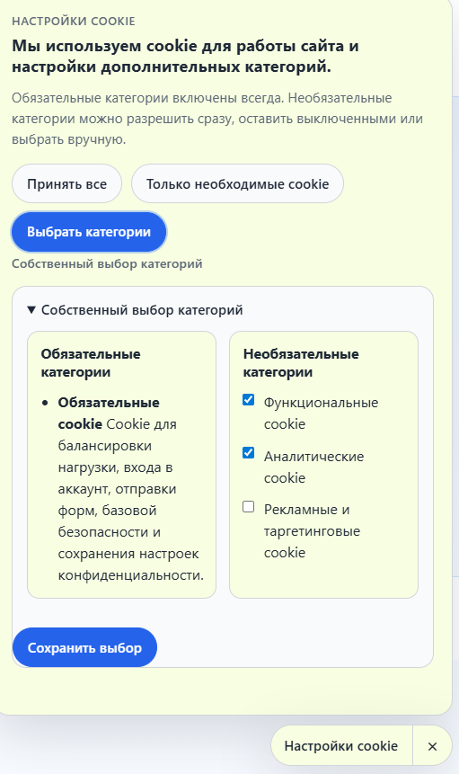
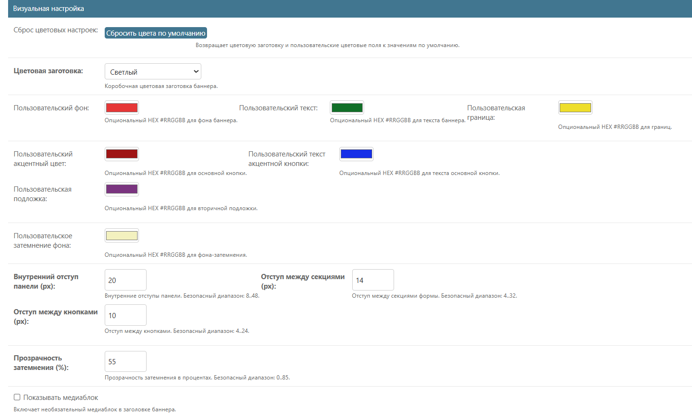
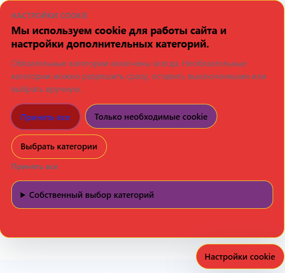
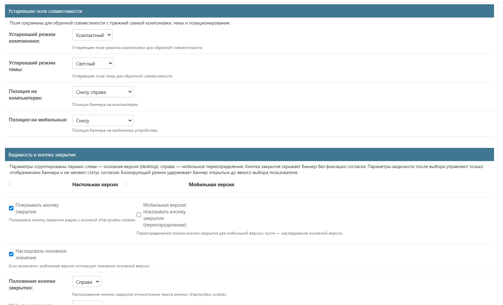
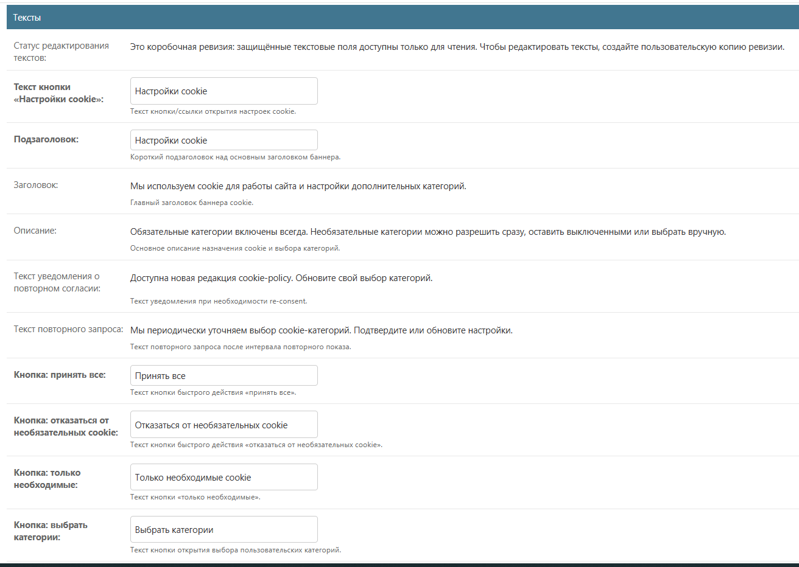

# Модуль cookie: тексты и оформление

- [К разделу cookie](./README.md)
- [К общему разделу документации](../README.md)

## Назначение

Этот документ описывает персонализацию внешнего вида и текстов cookie-баннера:

- что можно настроить без правки шаблонов;
- что меняется через административную панель;
- что задаётся через `settings.py`;
- когда достаточно коробочных вариантов, а когда нужен собственный CSS или JS.

Так баннер выглядит на сайте с коробочными настройками:

## Где хранятся тексты и оформление

Реализация использует модель `CookieBannerRevision`:

- хранит тексты, подписи кнопок и параметры оформления;
- публикуется отдельно от `CookiePolicyRevision`;
- редактируется через админку без хранения произвольного HTML или JavaScript;
- позволяет выпускать новые редакции внешнего вида независимо от редакций
  политики cookie.

Это значит, что оформление баннера и тексты баннера считаются частью
версируемой конфигурации, а не "зашитыми" в шаблон навсегда.

## Что можно менять без правки кода

Через `CookieBannerRevision` уже можно настраивать:

- вариант баннера;
- вариант интерфейса выбора;
- вариант уведомления о повторном согласии;
- текстовый пресет;
- мобильные переопределения для варианта и текстов;
- положение баннера на компьютерах и на мобильных устройствах;
- цветовой пресет;
- собственные цвета ключевых поверхностей и кнопок;
- внутренние и межсекционные отступы;
- прозрачность затемнения;
- видимость кнопки закрытия;
- поведение баннера после выбора пользователя;
- режим блокировки до первого явного выбора;
- отображение кнопки отказа и отдельных действий в мобильной версии;
- подключение пользовательского шаблона страницы настроек cookie.

## Базовые варианты отображения

Ключевые поля варианта:

- `banner_variant`: `bar` | `card` | `modal`;
- `consent_ui_variant`: `inline` | `panel`;
- `reconsent_notice_variant`: `inline` | `alert`;
- `text_preset_code`: `ru_balanced` | `ru_formal` | `ru_compact`.

Практический смысл:

- `bar` подходит для сдержанного компактного сценария;
- `card` подходит для большинства обычных сайтов и демо-стендов;
- `modal` подходит для более жёсткого фокуса на выборе пользователя;
- `inline` делает блок выбора короче;
- `panel` лучше подходит, когда категорий и пояснений больше;
- `alert` делает повторный запрос заметнее, чем `inline`.

Вариант `card` — компактная панель, прикреплённая к краю страницы:

Вариант `modal` — центрированное окно поверх затемнённой страницы, для более жёсткого фокуса на выборе:

Развёрнутая панель «Настроить» (`consent_ui_variant: panel`) — обязательные и необязательные категории рядом:

## Позиционирование и компоновка

Для баннера уже доступны отдельные параметры положения:

- `desktop_position`;
- `mobile_position`.

Поддерживаются, в частности, нижние варианты и режим
`bottom_fullwidth` - баннер снизу на всю ширину.

Используйте это так:

- для спокойного ненавязчивого интерфейса - нижнее размещение;
- для более явного требования выбора - модальный баннер;
- для мобильного сценария с длинными текстами - вариант на всю ширину снизу.

## Цвета и визуальная персонализация

Визуальный блок `CookieBannerRevision` уже поддерживает:

- `color_preset`;
- `custom_bg_color`;
- `custom_text_color`;
- `custom_primary_color`;
- `custom_primary_text_color`;
- `custom_border_color`;
- `custom_surface_color`;
- `custom_overlay_color`.

Что это даёт:

- можно взять коробочный цветовой пресет и использовать его без дополнительных
  правок;
- можно донастроить фирменные цвета бренда через HEX-значения;
- можно отдельно управлять фоном панели, текстом, основной кнопкой, границами,
  вторичной подложкой и затемняющим слоем.

Блок «Визуальная настройка» в редакции баннера:

Результат правки цветов — тот же баннер на сайте с пользовательской палитрой:

Ограничения:

- цвета проходят базовую валидацию;
- текст и фон проверяются на минимальный контраст для читаемости;
- произвольный HTML и свободный inline-стиль как основной механизм оформления
  не используются.

## Отступы и плотность интерфейса

Через `CookieBannerRevision` настраиваются:

- `panel_padding_px`;
- `section_gap_px`;
- `button_gap_px`;
- `overlay_opacity`.

Это позволяет:

- сделать баннер плотнее для компактного интерфейса;
- наоборот, разрядить его для более спокойного визуального ритма;
- усилить или ослабить затемнение фона у модального варианта.

Безопасные диапазоны уже ограничены на уровне модели, поэтому случайная правка в
админке не должна "сломать" компоновку.

## Мобильные переопределения

Для мобильной версии есть отдельные переопределения:

- `mobile_text_preset_code`;
- `mobile_banner_variant`;
- `mobile_consent_ui_variant`;
- `mobile_reconsent_notice_variant`;
- `mobile_close_control_placement`;
- `mobile_show_close_control`;
- `mobile_show_reject_action`;
- `mobile_blocking_mode_until_choice`;
- `mobile_hide_launcher_after_decision`;
- `mobile_keep_visible_after_accept_all`;
- `mobile_keep_visible_after_required_only`;
- `mobile_keep_visible_after_save_custom`.

Если поле пустое или не задано, используется наследование из основной версии.

Это полезно, когда:

- на мобильных устройствах нужен более короткий текстовый пресет;
- на мобильных устройствах нужен другой вариант баннера;
- поведение кнопки закрытия и видимость баннера должны отличаться от настольной
  версии.

## Поведение и видимость

На уровне оформления и пользовательского сценария уже поддерживаются:

- `show_close_control`;
- `close_control_placement`;
- `show_reject_action`;
- `blocking_mode_until_choice`;
- `hide_launcher_after_decision`;
- `keep_visible_after_accept_all`;
- `keep_visible_after_required_only`;
- `keep_visible_after_save_custom`;
- `hide_for_bots_override`.

Практический смысл:

- можно сделать баннер более мягким или более строгим;
- можно оставить кнопку повторного открытия после решения или скрывать её;
- можно не закрывать баннер автоматически после определённых действий;
- можно управлять показом баннера для bot-like запросов отдельно от глобальных
  настроек.

Блоки «Устаревшие поля совместимости» и «Видимость и кнопка закрытия» — положение баннера и поведение кнопки закрытия:

## Что настраивается через `settings.py`

Не всё оформление живёт только в базе. В `DJANGO_COOKIES_152FZ` остаются
настройки, которые лучше задавать на уровне проекта:

- `cookie_banner.preferences_page_template` - проектный шаблон страницы
  `/cookies/`;
- `cookie_runtime.custom_css_url` - дополнительный путь к CSS;
- `cookie_runtime.custom_js_url` - дополнительный путь к JS;
- `cookie_runtime.preview_param` - параметр предпросмотра;
- `cookie_runtime.hide_for_bots` и связанные runtime-настройки.

Разделение ответственности такое:

- база данных и админка - для текстов, вариантов, цветов и поведения редакции;
- `settings.py` - для подключения проектных файлов и технических настроек
  окружения.

## Когда достаточно админки, а когда нужен свой CSS

Обычно достаточно админки, если нужно:

- выбрать вариант баннера;
- переключить пресет текста;
- настроить цвета бренда;
- изменить отступы и прозрачность;
- сделать отдельный мобильный вариант;
- поменять поведение кнопок и режим показа.

Собственный CSS нужен, если требуется:

- встроить баннер в уже существующую дизайн-систему проекта;
- подогнать типографику, которой нет среди базовых параметров;
- скорректировать редкие локальные состояния интерфейса;
- адаптировать внешний вид под уже существующую тему сайта.

Собственный JS нужен только для дополнительного проектного поведения поверх
стандартного контракта, но не как основной способ настройки текстов и стилей.

## Рекомендуемый путь персонализации

Практически безопасный порядок такой:

1. Создайте пользовательскую копию `CookieBannerRevision`, а не редактируйте
   коробочную редакцию напрямую.
2. Выберите базовый `banner_variant`, `consent_ui_variant` и `text_preset`.
3. Настройте цвета через `color_preset` и `custom_*_color`.
4. Подгоните отступы и прозрачность.
5. Проверьте мобильные переопределения отдельно от настольной версии.
6. Только после этого подключайте `custom_css_url`, если стандартных полей
   оформления недостаточно.

## Что видно в административной панели

В административной панели раздел `Редакции cookie-баннера` уже разбит на
смысловые блоки:

- `Тексты`;
- `Варианты отображения`;
- `Визуальная настройка`;
- `Видимость и кнопка закрытия`;
- `Устаревшие поля совместимости`.

Для цветовых полей используется нативный выбор цвета браузера, поэтому базовую
персонализацию можно делать без ручного ввода всех значений.

Блок «Тексты» в редакции баннера:

## Контракт атрибутов в шаблоне

В разметке публикуются атрибуты:

- `data-cookie-banner-contract-version`;
- `data-cookie-banner-variant`;
- `data-cookie-banner-consent-ui`;
- `data-cookie-banner-reconsent-variant`;
- `data-cookie-banner-text-preset`;
- `data-cookie-banner-mobile-text-preset`;
- `data-cookie-banner-mobile-variant`;
- `data-cookie-banner-mobile-consent-ui`.

Это нужно для того, чтобы проектный CSS и проектные сценарии могли опираться на
стабильные признаки текущей опубликованной редакции.

## Режим блокировки до выбора

- при `blocking_mode_until_choice=True` баннер блокирует закрытие до явного
  выбора;
- после сохранённого выбора повторное открытие не включает блокировку страницы
  автоматически.

## Связанные документы

- [Конфигурация cookie-модуля](./configuration.md)
- [Использование и административная настройка](./operations-admin.md)
- [Инварианты cookie-модуля](./invariants.md)
- [Контракты событий и интеграции](./contracts.md)

## Навигация по разделу

- Предыдущий: [Контракт событий и перехватов](./contracts.md)
- Следующий: [Рекомендательная инвентаризация](./inventory.md)
